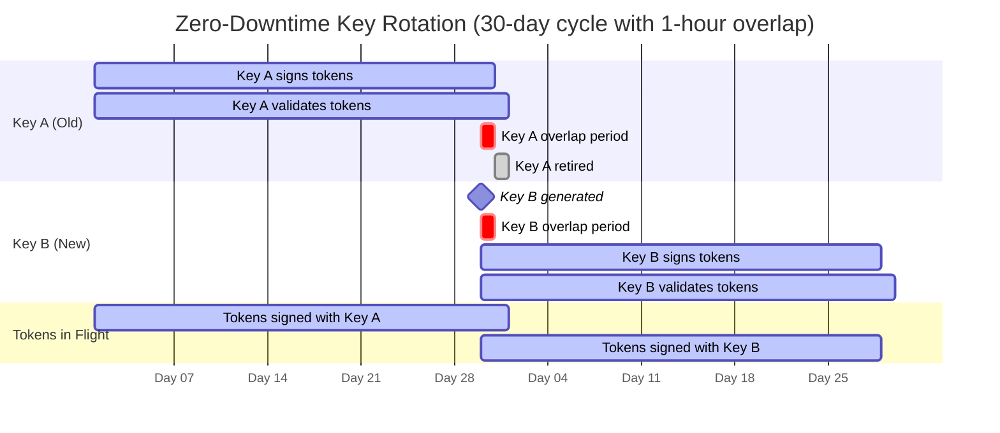
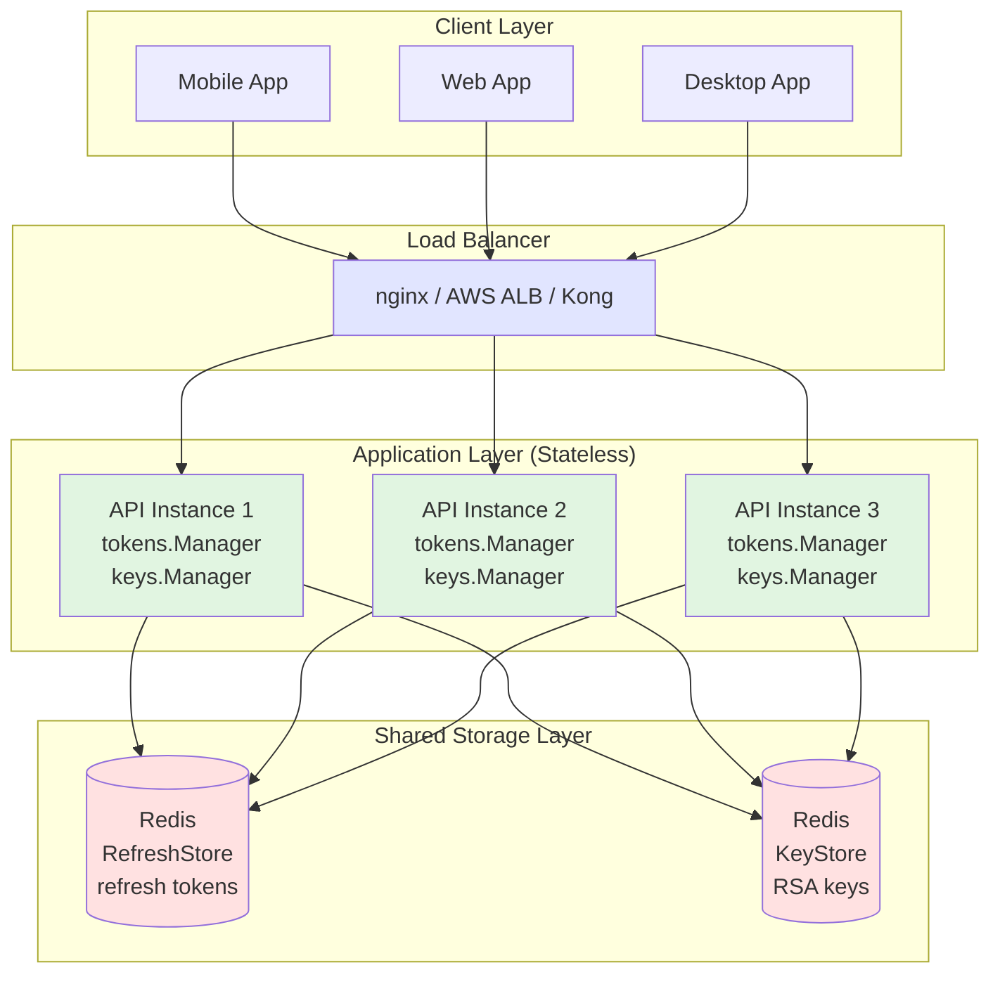
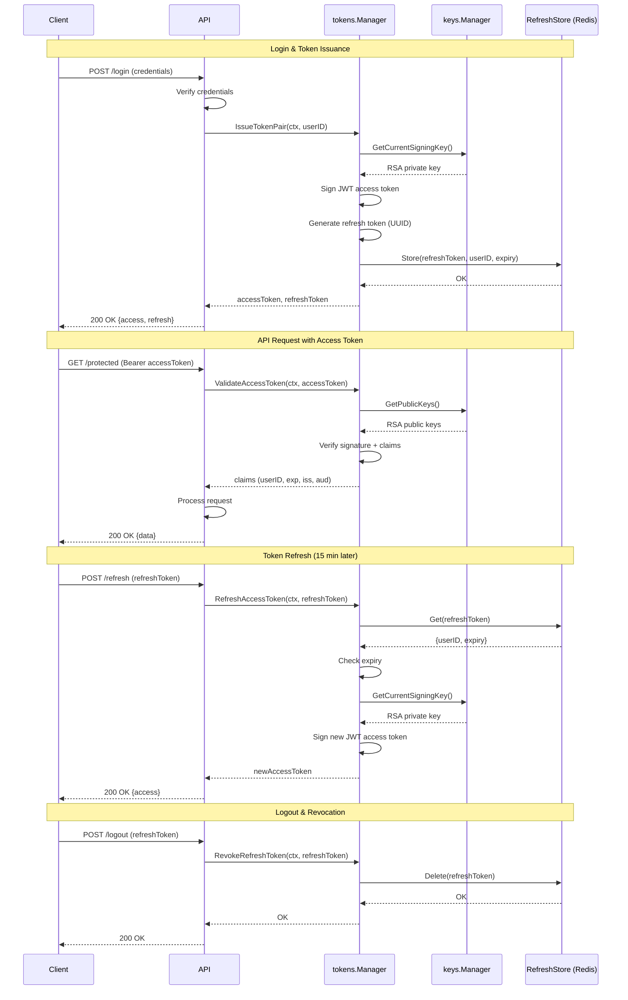

# jwtauth


**Stateful JWT authorization token engine for distributed Go applications**

**You verify identity. jwtauth manages everything after:** zero-downtime key rotation, access token issuance, refresh token lifecycle, and instant revocation across horizontal scale.

> **API Stability (pre-v1.0)**: All components are production-quality with comprehensive test coverage. The API surface is still evolving before v1.0.0 — v0.5.0 will add a variadic `IssueOption` parameter to the issuance methods for per-call audience targeting (#124). Changes will be additive and backwards-compatible.

## Overview

`jwtauth` is a **stateful** JWT authorization token engine for Go, built from the ground up with **observability, testability, and production operations** as first-class concerns. It manages the stateful machinery that production token systems require — cryptographic key generation and zero-downtime rotation, access token issuance and validation, and refresh token lifecycle with revocation support. Identity verification is intentionally out of scope: jwtauth takes a verified subject ID and handles everything after.

## What Problem Does This Solve?

**Most JWT libraries sign tokens. You still build the engine.**

After evaluating golang-jwt, gin-jwt, or jwx, teams realize the library solves 20% of the problem. You still need to build:

- **Key generation and zero-downtime rotation** — Weeks of careful work to ensure old tokens stay valid during rotation periods. Get it wrong and you force every user to re-authenticate.

- **Refresh token storage and lookup** — Days of work designing the schema, choosing the backend (Redis? Postgres?), handling expiration and revocation checks correctly.

- **Instant revocation without waiting for expiry** — Complex state management across distributed instances. Session compromise requires immediate invalidation, not waiting 15 minutes for token expiry.

- **Observability across the token lifecycle** — Usually ignored until production, then bolted on inconsistently. You need metrics on issuance rates, validation failures, rotation success, and revocation patterns.

- **Horizontal scale without state conflicts** — Hard to get right. Multiple instances need shared key storage and coordinated refresh token state. Most teams start with in-memory storage, hit production, then scramble to add Redis.

**jwtauth is the engine you'd build on top of those libraries** after a few months in production. We built it once, correctly, so you don't have to.

### What You Get

Everything after identity verification is handled:
- You verify identity (password check, OAuth exchange, SAML assertion)
- jwtauth issues access tokens, manages refresh tokens, rotates keys, and revokes sessions
- Your application validates tokens and enforces authorization rules

**Your boundary:** Identity verification (who is this user?)  
**jwtauth's job:** Token lifecycle management (how do I prove it to your API?)

## Why This Library?

If you've already decided you need stateful token management, here's how jwtauth compares to the alternatives you'd be evaluating:

| Feature | golang-jwt | gin-jwt | jwx | jwtauth |
|---------|-----------|---------|-----|---------|
| **Sign/Validate JWT** | ✅ | ✅ | ✅ | ✅ |
| **Custom claims** | ✅ | ✅ | ✅ | ✅ |
| **Key rotation** | ❌ Manual | ❌ | ❌ | ✅ Zero-downtime - Automatic|
| **Refresh tokens** | ❌ | ❌ | ❌ | ✅ Stateful storage |
| **Instant revocation** | ❌ | ❌ | ❌ | ✅ RevokeAllUserTokens |
| **Distributed state** | N/A | ❌ | N/A | ✅ Redis backend |
| **Metrics** | ❌ | ❌ | ❌ | ✅ 22 Prometheus metrics |
| **Correlation logging** | ❌ | ❌ | ❌ | ✅ Built-in |
| **Framework lock-in** | ❌ | ✅ Gin only | ❌ | ❌ |
| **Complexity** | Low | Medium | High (JOSE) | Medium |
| **Use when** | Stateless | Gin + stateless | JWE, JWS | Stateful + distributed |

**Zero-downtime key rotation** means you can rotate signing keys in production 
without invalidating any tokens currently in flight. Here's how it works:



During the **overlap period** (configurable, default 1 hour):
- New tokens are signed with Key B
- Old tokens signed with Key A remain valid
- After overlap expires, Key A is retired

Configuration:
```go
km, _ := keys.NewManager(keys.KeyManagerConfig{
    KeyRotationInterval: 30 * 24 * time.Hour,  // Rotate every 30 days
    KeyOverlapDuration:  1 * time.Hour,        // Keep old key valid for 1 hour
})
```
---

### vs. `golang-jwt/jwt` — building the engine yourself

`golang-jwt/jwt` signs and validates tokens against a key you supply. It does exactly one thing and does it well. Most teams start here and then spend weeks building the surrounding machinery:

| What you build yourself | What jwtauth provides |
|---|---|
| Key generation and storage | `KeyManager` with `DiskKeyStore` / `RedisKeyStore` |
| Zero-downtime key rotation + overlap | Built in — old key stays valid during overlap period |
| Refresh token storage and lookup | `MemoryRefreshStore` / `RedisRefreshStore` |
| Revocation (single token, all user sessions) | `RevokeRefreshToken`, `RevokeAllUserTokens` |
| Custom claims round-trip without re-parsing | `IssueAccessTokenWithClaims` + `ValidateAccessTokenWithClaims` |
| Clock skew tolerance for distributed deployments | `TokenManagerConfig.ClockSkew` |
| 22 Prometheus metrics across all operations | Pre-registered, zero config |
| 10 typed sentinel errors for middleware logic | `ErrTokenExpired`, `ErrTokenRevoked`, `ErrInvalidAudience`, … |

**jwtauth is what you'd build on top of golang-jwt after a few months in production.**

---

### vs. framework JWT middleware (`gin-jwt`, `echo-jwt`, similar)

Framework-specific JWT packages bundle signing, validation, and middleware into a single dependency. They're the fastest path to a working login endpoint but carry structural limitations:

- **No key rotation** — one static secret or key pair for the lifetime of the service
- **No refresh token state** — revocation requires a separate blocklist you build yourself
- **Framework lock-in** — the middleware only works with your chosen framework; switching means rewriting auth
- **No metrics** — you don't know how many tokens are being issued, validated, or rejected

`jwtauth` is framework-agnostic. The middleware in the examples is ~20 lines you own; swapping Gin for Chi or Echo is a one-file change.

---

### vs. `lestrrat-go/jwx` / `go-jose/go-jose` — JOSE toolkits

Both are comprehensive JOSE implementations covering JWS, JWE, JWK, JWT, and more. `jwtauth` is narrower and higher-level:

- The token lifecycle API (issue → validate → refresh → revoke) is ready — you're not assembling it from primitives
- Key rotation is built in, not something you wire together from JWK set operations
- Structured logging and metrics are first-class, not an afterthought
- Less surface area to reason about if you only need RS256 JWT tokens

If you need JWE (encrypted tokens), JWS detached payloads, or multi-algorithm JOSE operations, reach for one of those libraries instead.

---

### Concrete security guarantees

1. **Algorithm confusion prevented unconditionally** — `ValidateAccessToken` asserts `*jwt.SigningMethodRSA` before any key lookup. HS256, ECDSA, and `none` are rejected — not configurably, unconditionally.

2. **Reserved claim protection** — `IssueAccessTokenWithClaims` rejects custom claims that would overwrite `sub`, `exp`, `iat`, `nbf`, `jti`, `iss`, or `aud`. Application fields cannot collide with registered claims silently.

3. **10 granular sentinel errors, all `errors.Is()`-compatible** — middleware can distinguish `ErrTokenExpired` from `ErrTokenRevoked` from `ErrInvalidAudience` and return specific JSON error codes (`token_expired`, `token_revoked`, `invalid_audience`) that clients can act on.

4. **Instant revocation, not expiry-based** — `RevokeAllUserTokens` invalidates all sessions for a compromised account immediately. No waiting for short-lived tokens to expire.

---

### Horizontal scale path

The storage backends are designed to move from single-instance to distributed without code changes:

| Deployment | KeyStore | RefreshStore |
|---|---|---|
| Single instance (dev, small prod) | `DiskKeyStore` | `MemoryRefreshStore` |
| Multi-instance (Kubernetes, load-balanced) | `RedisKeyStore` | `RedisRefreshStore` |

Swap the constructor arguments. The `KeyManager` and `TokenManager` interfaces are unchanged.

---

**What jwtauth is not:** a full authorization server (no login flows, no OAuth2/OIDC), a session management library, or a rate limiter. For managed auth infrastructure, Keycloak, Dex, or Ory Hydra serve that role. jwtauth is the token engine you'd wire underneath them, or build directly into a service that already verifies identity by other means.

## When NOT to Use This

Good libraries state their boundaries. Here's when jwtauth is the **wrong choice**:

### ❌ You Need a Complete Authentication Server

**Don't use jwtauth if you need:**
- Login flows (username/password, OAuth callbacks, SAML assertion handling)
- User registration and account management
- Password reset flows and email verification
- Multi-factor authentication (MFA/2FA)
- Session management with cookies
- Identity provider integration (Google, GitHub, Auth0)

**Use instead:** [Keycloak](https://www.keycloak.org/), [Ory Hydra](https://www.ory.sh/hydra/), [Auth0](https://auth0.com/), [Dex](https://dexidp.io/)

**Why:** These provide complete authentication infrastructure. jwtauth assumes you've already verified identity and just need token machinery.

### ❌ You Only Need Stateless JWT Signing/Validation

**Don't use jwtauth if:**
- You don't need refresh tokens (short-lived access tokens are enough)
- You don't need revocation (expiry-based invalidation is acceptable)
- You're okay with manual key rotation (or no rotation at all)
- Single-instance deployment (no horizontal scaling)

**Use instead:** [golang-jwt/jwt](https://github.com/golang-jwt/jwt) — simpler, fewer dependencies, does one thing well

**Why:** Stateless JWT is conceptually simpler. If you don't need the stateful machinery (refresh tokens, revocation, key rotation), you're carrying unnecessary complexity.

### ❌ You Need Encrypted Tokens (JWE) or Multi-Algorithm JOSE

**Don't use jwtauth if you need:**
- JWE (JSON Web Encryption) for encrypted token payloads
- JWS detached payloads or nested tokens
- Multiple signing algorithms (ES256, EdDSA, etc.)
- Full JOSE (JWS, JWE, JWK, JWA) operations

**Use instead:** [lestrrat-go/jwx](https://github.com/lestrrat-go/jwx), [go-jose/go-jose](https://github.com/go-jose/go-jose)

**Why:** jwtauth supports RS256 only. If you need the full JOSE suite, reach for a comprehensive library.

### ❌ Framework-Specific Convenience is Your Priority

**Don't use jwtauth if:**
- You're using Gin and want zero configuration
- You want middleware that "just works" with your framework
- You're building a prototype and don't care about production operations
- Single file, copy-paste simplicity is more valuable than flexibility

**Use instead:** [gin-jwt/jwt](https://github.com/appleboy/gin-jwt) (for Gin), [echo-jwt](https://github.com/labstack/echo-jwt) (for Echo)

**Why:** Framework-specific middleware trades flexibility for convenience. If you're not running distributed systems in production, that trade-off might be worth it.

---

### ✅ Use jwtauth When

You've already verified identity and need **production-grade token machinery** for distributed systems:
- Zero-downtime key rotation (not manual)
- Instant revocation (not expiry-based)
- Horizontal scale with refresh token state
- Observability (metrics, logging, tracing)
- Stateful refresh token lifecycle

**Good fit:** Microservices, multi-instance deployments, production systems where token operations are critical infrastructure.

**Not a fit:** MVPs, single-instance apps, stateless architectures, or when you need an all-in-one auth server.

### Design Philosophy

- **Dependency Inversion**: All components depend on interfaces, not concrete implementations
- **Observability-First**: Structured logging and metrics built into every operation
- **Production-Ready**: Graceful shutdown, persistence, concurrent operations, comprehensive error handling
- **SOLID Principles**: Clean architecture that's easy to test, extend, and maintain
- **Zero External Dependencies**: Core functionality uses only Go standard library

## Key Features

### ✅ Currently Available

**KeyManager**
- **Zero-downtime key rotation** with configurable overlap periods
- **Automatic background rotation** with cleanup
- **RSA key pair generation** and management
- **JWKS (JSON Web Key Set)** endpoint support
- **Two KeyStore backends**: `DiskKeyStore` (PEM + JSON files) for single-instance; `RedisKeyStore` for distributed/multi-instance deployments
- **Thread-safe** concurrent operations with proper locking
- **Graceful shutdown** with in-flight operation completion
- **Structured logging** (slog adapter included, bring your own logger)
- **Full metrics instrumentation** — KeyStore and Manager operations via `jwtauth_keystore_*` and `jwtauth_key_*` metrics
- **OpenTelemetry distributed tracing** — `Tracer` field wires spans into all key operations; defaults to `NoOpTracer` for zero-config use
- **Namespace labeling** — `Namespace` field propagates an opaque label through all logs, spans, and metric labels for multi-tenant and multi-instance deployments
- **Comprehensive test coverage** with race detection

**TokenManager**
- **Access token issuance** (IssueAccessToken, IssueAccessTokenWithClaims, IssueTokenPair, IssueTokenPairWithClaims)
- **Refresh token issuance** (IssueRefreshToken, IssueRefreshTokenWithClaims)
- **Access token validation** with registered and custom claims extraction (ValidateAccessToken, ValidateAccessTokenWithClaims)
- **Token refresh flow** (RefreshAccessToken, RefreshAccessTokenWithClaims) with expiration and revocation checks
- **Token revocation** (RevokeRefreshToken, RevokeAllUserTokens) for logout and security scenarios
- **Token introspection** (IntrospectToken) per RFC 7662 — returns active/inactive status with metadata
- **Cursor-based token enumeration** (ListTokens, ListTokensForUser) for reconciliation jobs, audit pipelines, and bulk operations — pagination over global or per-user token sets
- **Manual token cleanup** (CleanupExpiredTokens) for on-demand expiration sweeps
- **RS256 signing** with custom claims support and reserved claim protection
- **Clock skew tolerance** (`ClockSkew` field) for distributed deployments with NTP drift
- **Lifecycle management** (Start/Shutdown/IsRunning) with graceful operations
- **Background cleanup goroutines** with configurable interval and proper synchronization
- **Service state management** ensuring tokens only issue when service is running
- **OpenTelemetry distributed tracing** — `Tracer` field wires spans into all token operations; defaults to `NoOpTracer` for zero-config use
- **Namespace labeling** — `Namespace` field propagates an opaque label through all logs, spans, and metric labels for multi-tenant and multi-instance deployments
- **Comprehensive BDD test coverage** (153 tests covering lifecycle, issuance, validation, clock skew, custom claims, refresh, revocation, and introspection; ~87% statement coverage)

**RefreshTokenStore** ✅
- **Two implementations**: Memory (in-process) and Redis (distributed)
- **MemoryRefreshStore**: In-memory storage with thread-safe RWMutex locking
  - Perfect for single-instance deployments and testing
  - Dual-index lookups (tokenID → token, userID → []tokenID) for O(1) retrieval
  - Defensive copying for isolation from caller mutations
  - 77 comprehensive tests with 100% statement coverage
- **RedisRefreshStore**: Distributed storage for multi-instance deployments
  - Uses go-redis/v9 with pipeline support for atomic operations
  - Millisecond-precision timestamp storage
  - Efficient SCAN-based cleanup for expired tokens
  - Production-ready error handling and logging
  - 77 comprehensive tests (identical test suite as Memory implementation)
- **Shared test suite** pattern: Single suite (77 tests) runs against both implementations
- **Common features** (both implementations):
  - Token lifecycle management (Store, Retrieve, Revoke, RevokeAllForUser, Cleanup)
  - **Cursor-based enumeration**: `ListTokens` iterates all tokens globally; `ListTokensForUser` iterates a single user's tokens — pass `""` as cursor to start from the beginning
  - Expiration and revocation checks with per-request validation
  - Idempotent revocation (safe to call multiple times)
  - Comprehensive context handling with cancellation propagation
  - Structured logging for audit trail
  - **154 total storage tests** (77 × 2 implementations)

## Architecture Highlights

### Observability as a Core Design Principle

Every component accepts optional logging and metrics interfaces:

```go
import (
    "github.com/aetomala/jwtauth/pkg/keys"
    "github.com/aetomala/jwtauth/pkg/logging"
    "github.com/aetomala/jwtauth/pkg/metrics"
    "github.com/aetomala/jwtauth/pkg/tracing"
)

ks, _ := keys.NewDiskKeyStore(keys.DiskKeyStoreConfig{
    Dir:    "/var/keys",
    Logger: logging.NewJSONLogger(slog.LevelInfo),
})
config := keys.KeyManagerConfig{
    KeyStore:            ks,
    KeyRotationInterval: 30 * 24 * time.Hour, // 30 days
    KeyOverlapDuration:  1 * time.Hour,        // 1 hour overlap

    // Optional: Bring your own logger
    Logger: logging.NewJSONLogger(slog.LevelInfo),

    // Optional: Bring your own metrics
    Metrics: metrics.NewPrometheusMetrics(metrics.PrometheusConfig{
        Namespace: "myapp",
    }),

    // Optional: Bring your own tracer (defaults to NoOpTracer)
    Tracer: tracing.NewOtelTracer("jwtauth"),
}
```

### Key Rotation with Zero Downtime

```
Day 0:    Key A (current, signs new tokens)
          ↓
Day 30:   Rotate → Key A (validates old tokens), Key B (current, signs new tokens)
          ↓ [1 hour overlap period]
Day 30+1h: Key B (current, only valid key)
```

**Why this matters**: Services can validate tokens signed with old keys during the overlap period, ensuring zero service disruption during rotation.

### Dependency Inversion Pattern

Components depend on abstractions, not concrete implementations:

```go
// ✅ KeyManager depends on interfaces
type KeyManagerConfig struct {
    KeyStore KeyStore         // Interface, not *DiskKeyStore
    Logger   logging.Logger  // Interface, not *slog.Logger
    Metrics  metrics.Metrics // Interface, not *PrometheusMetrics
}

// Easy to swap implementations:
logger := logging.NewJSONLogger(slog.LevelInfo)      // Production
logger := logging.NewTextLogger(slog.LevelDebug)     // Development
logger := logging.NewNoOpLogger()                     // Disable logging
logger := yourCustomAdapter{}                         // Your own logger
```

**Benefits**:
- Easy to test (mock implementations)
- Easy to integrate (adapt your existing logging/metrics)
- No forced dependencies (optional observability)
- Follows SOLID principles (open for extension, closed for modification)

## Installation

```bash
# Will be available as:
go get github.com/aetomala/jwtauth
```

**Current Status**: v0.4.0 — production-quality, pre-v1.0. See the API Stability note above.

## Quick Start

### Basic KeyManager Usage

```go
package main

import (
    "context"
    "log"
    "time"
    
    "github.com/aetomala/jwtauth/pkg/keys"
)

func main() {
    // Create DiskKeyStore for key persistence
    ks, err := keys.NewDiskKeyStore(keys.DiskKeyStoreConfig{Dir: "./keys"})
    if err != nil {
        log.Fatal(err)
    }

    // Create KeyManager
    manager, err := keys.NewManager(keys.KeyManagerConfig{
        KeyStore:            ks,
        KeyRotationInterval: 30 * 24 * time.Hour,
        KeyOverlapDuration:  1 * time.Hour,
    })
    if err != nil {
        log.Fatal(err)
    }
    
    // Start background rotation
    ctx := context.Background()
    if err := manager.Start(ctx); err != nil {
        log.Fatal(err)
    }
    defer manager.Shutdown(ctx)
    
    // Get current signing key
    _, keyID, err := manager.GetCurrentSigningKey(ctx)
    if err != nil {
        log.Fatal(err)
    }
    log.Printf("Current key ID: %s", keyID)
    
    // Get JWKS for token validation
    jwks, err := manager.GetJWKS()
    if err != nil {
        log.Fatal(err)
    }
    log.Printf("Available keys: %d", len(jwks.Keys))
}
```

### Key Inspection

`GetCurrentKeyInfo` returns key metadata — safe to expose from health checks or admin endpoints:

```go
info, err := km.GetCurrentKeyInfo(ctx)
if err != nil {
    log.Fatal(err)
}
log.Printf("Key: %s | Age: %s | Rotates at: %s | Valid: %v",
    info.KeyID,
    time.Since(info.CreatedAt).Round(time.Second),
    info.RotateAt.Format(time.RFC3339),
    info.IsValid,
)
```

Look up a specific key by its `kid` JWT header claim:

```go
info, err := km.GetKeyInfo(ctx, kid)
// info.IsCurrent reports whether this is the active signing key
// info.IsValid reports whether it has not yet expired
```

See `examples/health-check/` and `examples/prometheus-metrics/` for complete runnable examples.

### With Observability

```go
import (
    "log/slog"
    "os"
    
    "github.com/aetomala/jwtauth/pkg/keys"
    "github.com/aetomala/jwtauth/pkg/logging"
)

func main() {
    // Configure structured logging (JSON for production)
    logger := logging.NewJSONLogger(slog.LevelInfo)
    pm := metrics.NewPrometheusMetrics(metrics.PrometheusConfig{})

    ks, err := keys.NewDiskKeyStore(keys.DiskKeyStoreConfig{Dir: "./keys", Logger: logger, Metrics: pm})
    if err != nil {
        log.Fatal(err)
    }

    manager, err := keys.NewManager(keys.KeyManagerConfig{
        KeyStore:            ks,
        KeyRotationInterval: 30 * 24 * time.Hour,
        KeyOverlapDuration:  1 * time.Hour,
        Logger:              logger,
        Metrics:             pm,
    })
    if err != nil {
        log.Fatal(err)
    }
    
    ctx := context.Background()
    manager.Start(ctx)
    defer manager.Shutdown(ctx)
    
    // All operations are logged with structured fields
    // Example log output:
    // {"time":"2026-02-07T12:00:00Z","level":"INFO","msg":"key manager started","active_keys":2}
    // {"time":"2026-02-07T12:30:00Z","level":"INFO","msg":"key rotation successful","key_id":"key_20260207_120000","duration":"150ms"}

    // Metrics are available at /metrics (Prometheus text format)
    http.Handle("/metrics", pm.Handler())
}
```

### TokenManager Usage

```go
package main

import (
    "context"
    "log"
    "time"

    "github.com/aetomala/jwtauth/pkg/tokens"
    // ... other imports
)

func main() {
    // Create TokenManager with storage
    config := tokens.TokenManagerConfig{
        KeyManager:           keyManager,      // from KeyManager above
        RefreshStore:         refreshStore,    // RefreshStore implementation
        Logger:               logger,          // Optional
        Metrics:              pm,              // Optional — wire PrometheusMetrics for observability
        AccessTokenDuration:  15 * time.Minute,
        RefreshTokenDuration: 30 * 24 * time.Hour,
        CleanupInterval:      1 * time.Hour,   // Auto-cleanup of expired tokens
        ClockSkew:            30 * time.Second, // Optional leeway for NTP drift in distributed deployments
        Issuer:               "my-app",
        Audience:             []string{"my-app-api"},
    }

    mgr, err := tokens.NewManager(config)
    if err != nil {
        log.Fatal(err)
    }

    // Start manager lifecycle
    ctx := context.Background()
    if err := mgr.Start(ctx); err != nil {
        log.Fatal(err)
    }
    defer mgr.Shutdown(ctx)

    // Issue access token with custom claims
    token, err := mgr.IssueAccessTokenWithClaims(ctx, "user-123", tokens.CustomClaims{
        "role": "admin",
        "tenant": "org-456",
    })
    if err != nil {
        log.Fatal(err)
    }

    // Validate token and retrieve custom claims
    registered, custom, err := mgr.ValidateAccessTokenWithClaims(ctx, token)
    if err != nil {
        log.Fatal(err)
    }
    log.Printf("User: %s, Role: %s", registered.Subject, custom["role"])
}
```

**Key Features**:
- ✅ Automatic lifecycle management (Start/Shutdown)
- ✅ Service state checking (IsRunning) ensures tokens only issue when running
- ✅ Custom claims support with reserved claim protection
- ✅ Custom claims retrieval after validation (ValidateAccessTokenWithClaims)
- ✅ Clock skew tolerance (ClockSkew) for distributed deployments with NTP drift
- ✅ Background cleanup of expired refresh tokens
- ✅ Structured logging and metrics integration

## Production Architecture

jwtauth is designed for horizontal scale from day one:



**Key characteristics:**
- **Stateless API layer** - Add/remove instances freely
- **Shared Redis** - Consistent state across all instances
- **Zero-downtime key rotation** - Coordinated via KeyStore
- **Instant revocation** - RefreshStore backed by Redis

See [doc/DEPLOYMENT.md](doc/DEPLOYMENT.md) for complete deployment guide.

## How It Works

Here's the complete token lifecycle from login to refresh to revocation:



The sequence shows how `tokens.Manager` coordinates with `keys.Manager` 
and your `RefreshStore` to handle the complete authentication flow.

## Configuration

### KeyManagerConfig

| Field | Type | Required | Default | Description |
|-------|------|----------|---------|-------------|
| `KeyStore` | `KeyStore` | Yes | - | Key persistence backend — use `NewDiskKeyStore` for single-instance or a custom implementation for distributed deployments |
| `KeyRotationInterval` | `time.Duration` | Yes | - | How often to rotate keys (e.g., 30 days) |
| `KeyOverlapDuration` | `time.Duration` | Yes | - | Overlap period for zero-downtime rotation |
| `Logger` | `logging.Logger` | No | `NoOpLogger` | Structured logger; defaults to no-op if nil |
| `Metrics` | `metrics.Metrics` | No | `NoOpMetrics` | Metrics collector; defaults to no-op if nil |
| `Tracer` | `tracing.Tracer` | No | `NoOpTracer` | OTel tracer; nil defaults to no-op |
| `Namespace` | `string` | No | `""` | Opaque label on all logs, spans, and metric labels — empty disables |
| `KeySize` | `int` | No | `2048` | RSA key size in bits (minimum 2048) |

### TokenManagerConfig

| Field | Type | Required | Default | Description |
|-------|------|----------|---------|-------------|
| `KeyManager` | `keys.KeyManager` | Yes | — | Signs and validates tokens |
| `RefreshStore` | `storage.RefreshStore` | Yes | — | Persists refresh tokens |
| `Logger` | `logging.Logger` | No | `NoOpLogger` | Structured logger; defaults to no-op if nil |
| `Metrics` | `metrics.Metrics` | No | `NoOpMetrics` | Metrics collector; defaults to no-op if nil |
| `Tracer` | `tracing.Tracer` | No | `NoOpTracer` | OTel tracer; nil defaults to no-op |
| `Namespace` | `string` | No | `""` | Opaque label on all logs, spans, and metric labels — empty disables |
| `AccessTokenDuration` | `time.Duration` | No | `15m` | Access token TTL |
| `RefreshTokenDuration` | `time.Duration` | No | `30d` | Refresh token TTL |
| `CleanupInterval` | `time.Duration` | No | `1h` | How often expired tokens are purged |
| `ClockSkew` | `time.Duration` | No | `0` | Leeway applied to `exp`/`nbf` validation — zero means strict |
| `Issuer` | `string` | No | `""` | Value for the JWT `iss` claim |
| `Audience` | `[]string` | No | `nil` | Values for the JWT `aud` claim |

### Recommended Settings

**Production (single-instance)**:
```go
ks, _ := keys.NewDiskKeyStore(keys.DiskKeyStoreConfig{
    Dir:    "./keys",
    Logger: logging.NewJSONLogger(slog.LevelInfo),
})
config := keys.KeyManagerConfig{
    KeyStore:            ks,
    KeyRotationInterval: 30 * 24 * time.Hour,  // 30 days
    KeyOverlapDuration:  1 * time.Hour,         // 1 hour
    Logger:              logging.NewJSONLogger(slog.LevelInfo),
}
```

**Production (distributed / multi-instance)**:
```go
client := redis.NewClient(&redis.Options{Addr: "redis:6379"})
ks, _ := keys.NewRedisKeyStore(keys.RedisKeyStoreConfig{Client: client, Logger: logger})
config := keys.KeyManagerConfig{
    KeyStore:            ks,
    KeyRotationInterval: 30 * 24 * time.Hour,
    KeyOverlapDuration:  1 * time.Hour,
    Logger:              logging.NewJSONLogger(slog.LevelInfo),
}
```

**Development**:
```go
ks, _ := keys.NewDiskKeyStore(keys.DiskKeyStoreConfig{
    Dir:    "./keys",
    Logger: logging.NewTextLogger(slog.LevelDebug),
})
config := keys.KeyManagerConfig{
    KeyStore:            ks,
    KeyRotationInterval: 24 * time.Hour,        // 1 day (faster testing)
    KeyOverlapDuration:  5 * time.Minute,        // 5 minutes
    Logger:              logging.NewTextLogger(slog.LevelDebug),
}
```

## Error Reference

All `TokenManager` errors are exported sentinels compatible with `errors.Is()`. Middleware and API handlers should switch on these to return specific responses.

| Error | Trigger | Client-side action |
|-------|---------|-------------------|
| `tokens.ErrTokenExpired` | Token past `exp` (including `ClockSkew` window) | Prompt token refresh or re-authorization |
| `tokens.ErrTokenNotYetValid` | Current time before `nbf` claim | Retry after a short delay |
| `tokens.ErrInvalidIssuer` | `iss` claim does not match configured issuer | Do not retry — configuration mismatch |
| `tokens.ErrInvalidAudience` | `aud` claim does not match configured audience | Do not retry — configuration mismatch |
| `tokens.ErrInvalidToken` | Malformed, wrong signing algorithm, or unknown `kid` | Do not retry — request a new token |
| `tokens.ErrTokenRevoked` | Refresh token explicitly revoked | Force re-login |
| `tokens.ErrInvalidRefreshToken` | Refresh token not found in store | Force re-login |
| `tokens.ErrRefreshTokenExpired` | Refresh token past its TTL | Force re-login |
| `tokens.ErrInvalidUserID` | Empty or whitespace-only `userID` passed to issuance method | Fix caller — input validation error |
| `tokens.ErrManagerNotRunning` | Token operation called before `Start()` or after `Shutdown()` | Fix caller — lifecycle management error |

```go
// Example: mapping errors to HTTP responses in middleware
claims, err := mgr.ValidateAccessToken(r.Context(), token)
switch {
case errors.Is(err, tokens.ErrTokenExpired):
    writeJSON(w, 401, `{"error":"token_expired"}`)
case errors.Is(err, tokens.ErrTokenRevoked):
    writeJSON(w, 401, `{"error":"token_revoked"}`)
case err != nil:
    writeJSON(w, 401, `{"error":"invalid_token"}`)
}
```

See [examples/](examples/) for complete middleware implementations for Chi, Echo, and Gin.

## Observability Integration

### Logging

**Built-in adapters**:
- `logging.NewJSONLogger()` - JSON output for log aggregators (ELK, Loki, Splunk)
- `logging.NewTextLogger()` - Human-readable text for development
- `logging.NewNoOpLogger()` - Disable logging

**Bring your own logger**:
```go
// Implement the simple Logger interface
type Logger interface {
    Debug(msg string, args ...interface{})
    Info(msg string, args ...interface{})
    Warn(msg string, args ...interface{})
    Error(msg string, args ...interface{})
    With(keysAndValues ...interface{}) Logger
}

// Adapt your existing logger
type MyZapAdapter struct {
    logger *zap.Logger
}

func (m *MyZapAdapter) Debug(msg string, args ...interface{}) {
    m.logger.Sugar().Debugw(msg, args...)
}
func (m *MyZapAdapter) Info(msg string, args ...interface{}) {
    m.logger.Sugar().Infow(msg, args...)
}
// ... implement Warn, Error, With
```

### Correlation ID

Correlation IDs let you filter all log lines from a single request across every internal component — KeyManager, RefreshStore, and TokenManager — with a single `jq` query.

**Quick start**:

```go
// 1. Build a logger with CorrelationIDHandler pre-wired
logger := logging.NewCorrelationJSONLogger(slog.LevelInfo)

// 2. HTTP middleware: extract or generate an ID, inject into context
func correlationMiddleware(next http.Handler) http.Handler {
    return http.HandlerFunc(func(w http.ResponseWriter, r *http.Request) {
        id := r.Header.Get("X-Correlation-ID")
        if id == "" {
            id = uuid.NewString() // or any unique ID
        }
        ctx := logging.WithCorrelationID(r.Context(), id)
        w.Header().Set("X-Correlation-ID", id)
        next.ServeHTTP(w, r.WithContext(ctx))
    })
}

// 3. Pass ctx through — all internal logs automatically carry correlation_id
accessToken, refreshToken, err := mgr.IssueTokenPair(ctx, userID)
```

**Before** (hard to correlate):
```json
{"level":"INFO","msg":"refresh token stored","userID":"alice"}
{"level":"INFO","msg":"access token issued","userID":"bob"}
{"level":"INFO","msg":"refresh token stored","userID":"alice"}
```

**After** (trivial to filter):
```json
{"level":"INFO","msg":"refresh token stored","userID":"alice","correlation_id":"req-001"}
{"level":"INFO","msg":"access token issued","userID":"bob","correlation_id":"req-002"}
{"level":"INFO","msg":"refresh token stored","userID":"alice","correlation_id":"req-001"}
```

```bash
# Isolate a single request across all components
jq 'select(.correlation_id=="req-001")' app.log
```

**Key design points**:
- `logging.WithCorrelationID(ctx, id)` — attaches the ID to a context
- `logging.GetCorrelationID(ctx)` — retrieves it (returns `""` if absent)
- `logging.NewCorrelationIDHandler(h slog.Handler)` — wraps any `slog.Handler`; use this when building your own `slog.Logger`
- `logging.NewCorrelationJSONLogger(level)` / `logging.NewCorrelationTextLogger(level)` — convenience constructors with the handler pre-wired
- Background operations (cleanup goroutines) use `context.Background()` — no ID is emitted, no spurious empty fields
- Zero breaking changes — the `Logger` interface is unchanged; custom implementations continue to work

See [examples/correlation-example/](examples/correlation-example/) for a complete stdlib HTTP server demonstrating middleware, login, refresh, and validate endpoints with correlated logs.

### Metrics

**Interface** (`pkg/metrics/Metrics`):
```go
type Metrics interface {
    IncrementCounter(name string, labels map[string]string)
    AddCounter(name string, value float64, labels map[string]string)
    SetGauge(name string, value float64, labels map[string]string)
    RecordHistogram(name string, value float64, labels map[string]string)
    RecordDuration(name string, duration time.Duration, labels map[string]string)
}
```

**Available implementations**:
- `metrics.NewPrometheusMetrics()` — Prometheus with `/metrics` endpoint, pre-registers all jwtauth metrics at construction time
- `metrics.NewNoOpMetrics()` — no-op, zero overhead, for when metrics are disabled

**Prometheus quick start**:
```go
pm := metrics.NewPrometheusMetrics(metrics.PrometheusConfig{
    Namespace: "myapp",   // defaults to "jwtauth"
})

// Serve metrics endpoint
http.Handle("/metrics", pm.Handler())

// Pass pm to every constructor that accepts it
ks, _ := keys.NewDiskKeyStore(keys.DiskKeyStoreConfig{Dir: "./keys", Logger: logger, Metrics: pm})
km, _ := keys.NewManager(keys.KeyManagerConfig{KeyStore: ks, Metrics: pm})
store := storage.NewMemoryRefreshStore(storage.MemoryRefreshStoreConfig{Logger: logger, Metrics: pm})
mgr, _ := tokens.NewManager(tokens.TokenManagerConfig{
    KeyManager:   km,
    RefreshStore: store,
    Metrics:      pm,
})
```

**Metric reference** (22 metrics, namespace `jwtauth_` by default):

| Metric | Type | Labels | Description |
|--------|------|--------|-------------|
| `tokens_issued_total` | Counter | `status`, `error_type` | Tokens issued (access + refresh) |
| `tokens_validated_total` | Counter | `status`, `error_type` | Access token validations |
| `tokens_refreshed_total` | Counter | `status`, `error_type` | Refresh operations |
| `tokens_revoked_total` | Counter | `operation`, `status` | Revocation calls |
| `tokens_introspected_total` | Counter | `status` | RFC 7662 introspection calls |
| `operations_total` | Counter | `operation`, `status` | General service operations |
| `operation_duration_seconds` | Histogram | `operation` | Service operation latency |
| `active_tokens` | Gauge | `storage_backend` | Active token count |
| `service_running` | Gauge | — | `1` when running, `0` when stopped |
| `storage_operations_total` | Counter | `operation`, `status`, `error_type`, `storage_backend` | RefreshStore operations |
| `storage_cleanup_tokens_removed_total` | Counter | `storage_backend` | Tokens removed during cleanup |
| `storage_operation_duration_seconds` | Histogram | `operation`, `storage_backend` | Storage operation latency |
| `storage_tokens_count` | Gauge | `storage_backend` | Tokens currently in storage |
| `keystore_operations_total` | Counter | `operation`, `status`, `error_type`, `storage_backend` | KeyStore operations |
| `keystore_operation_duration_seconds` | Histogram | `operation`, `storage_backend` | KeyStore operation latency |
| `keystore_keys_count` | Gauge | `storage_backend` | Keys in key store |
| `key_rotations_total` | Counter | `status`, `error_type` | Key rotation attempts |
| `key_signing_operations_total` | Counter | `status`, `error_type` | Signing key retrievals |
| `key_validation_operations_total` | Counter | `status`, `error_type` | Validation key retrievals |
| `key_operation_duration_seconds` | Histogram | `operation` | Key operation latency |
| `key_current_version` | Gauge | — | Active key version number |
| `key_active_versions_count` | Gauge | — | Active key version count |

**Label conventions**:
- `status` — `"success"` on the happy path, a short error code on failure (e.g. `"token_expired"`, `"key_not_found"`)
- `error_type` — `""` on success, mirrors the `status` value on failure — follows the OpenTelemetry `error.type` semantic convention
- `storage_backend` — `"memory"`, `"redis"`, or `"disk"`

**Example PromQL queries**:
```promql
# Token issuance error rate
rate(jwtauth_tokens_issued_total{status!="success"}[5m])

# Token validation failures broken down by error type
rate(jwtauth_tokens_validated_total{status!="success"}[5m]) by (error_type)

# Storage operation latency p99
histogram_quantile(0.99, rate(jwtauth_storage_operation_duration_seconds_bucket[5m]))

# Active key version count (alert if this drops to 0)
jwtauth_key_active_versions_count
```

**Alerting guidance**:
- `jwtauth_key_active_versions_count == 0` → critical — no signing key available, all token issuance will fail
- `rate(jwtauth_key_rotations_total{status!="success"}[1h]) > 0` → warning — key rotation is failing
- `jwtauth_service_running == 0` → critical — TokenManager has stopped

For the full operator reference including Grafana dashboard guidance and label cardinality analysis, see [doc/METRICS.md](doc/METRICS.md).

**Planned implementations**:
- StatsD (for Datadog, Graphite)
- CloudWatch (for AWS environments)

### Distributed Tracing

Every component emits OpenTelemetry-compatible spans. Tracing is opt-in — all constructors default to `NoOpTracer` so existing code requires no changes.

**Quick start**:

```go
import (
    "go.opentelemetry.io/otel"
    "github.com/aetomala/jwtauth/pkg/tracing"
    "github.com/aetomala/jwtauth/pkg/keys"
    "github.com/aetomala/jwtauth/pkg/storage"
    "github.com/aetomala/jwtauth/pkg/tokens"
)

// Wire your OTel TracerProvider (OTLP, Jaeger, Tempo, etc.) then:
tracer := tracing.NewOtelTracer("jwtauth")

ks, _ := keys.NewDiskKeyStore(keys.DiskKeyStoreConfig{
    Dir:    "./keys",
    Tracer: tracer,
})
km, _ := keys.NewManager(keys.KeyManagerConfig{
    KeyStore: ks,
    Tracer:   tracer,
})
store := storage.NewMemoryRefreshStore(storage.MemoryRefreshStoreConfig{Tracer: tracer})
mgr, _ := tokens.NewManager(tokens.TokenManagerConfig{
    KeyManager:   km,
    RefreshStore: store,
    Tracer:       tracer,
})
```

**Span naming**: `<TypeName>.<MethodName>` — e.g., `TokenManager.IssueAccessToken`, `DiskKeyStore.Save`.

**Span attributes by component**:

| Component | Attributes |
|-----------|-----------|
| `DiskKeyStore` / `RedisKeyStore` | `storage.backend` (`"disk"` / `"redis"`), `key_id` |
| `MemoryRefreshStore` / `RedisRefreshStore` | `storage.backend` (`"memory"` / `"redis"`), `token_id` |
| `KeyManager` | `key_id` |
| `TokenManager` | `user_id`, `token_id`, `active` (IntrospectToken), `deleted_count` (CleanupExpiredTokens) |

All spans set `StatusOK` on success and `RecordError` + `StatusError` on failure. For deployment setup and `TracerProvider` configuration, see [doc/DEPLOYMENT.md](doc/DEPLOYMENT.md).


## Project Structure

See [doc/ARCHITECTURE.md](doc/ARCHITECTURE.md#project-structure) for the package layout and API stability status.

## Testing

### Test Coverage

**Current**: 605 comprehensive tests across KeyManager, TokenManager, RefreshStore, Metrics, Logging, and Tracing, all passing with race detection (KeyManager ~90%, TokenManager ~87%, RefreshStore 100%, Metrics 100%, Logging 100%, Tracing 100%)

**KeyManager** (3 test suites — 125 total specs):
- **9-phase Manager tests** (52 specs, MockKeyStore — no I/O):
  - Constructor validation, config defaults, ErrInvalidKeyStore
  - Start: loads from store, generates key on empty store, error paths
  - GetCurrentSigningKey, GetPublicKey (cache hit/miss), GetJWKS
  - RotateKeys: Save + UpdateMetadata calls, currentKeyID update
  - Shutdown: scheduler stop, idempotency, context timeout
  - Metrics recording: rotation counter/duration, signing/validation counters, active-versions gauge
- **10-phase DiskKeyStore tests** (42 specs, real tmp directory):
  - Constructor, Save (0600 permissions, companion JSON), LoadAll
  - LoadKey (key size validation), UpdateMetadata, Delete (idempotent)
  - Error handling, concurrency, metrics recording (storage_backend: "disk"), tracing
- **10-phase RedisKeyStore tests** (39 specs, miniredis):
  - Constructor (nil client returns ErrNilRedisClient), Save round-trip, LoadAll (skip expired)
  - LoadKey, UpdateMetadata, Delete (idempotent)
  - Error handling: corrupt metadata, missing metadata entry, Redis unavailability via SetError
  - Concurrency, metrics recording (storage_backend: "redis")

**TokenManager** (7 test suites, 153 total tests):
- **Lifecycle Management Tests** (20 tests):
  - Start: idempotency, logging, background cleanup, failure handling, context cancellation
  - Shutdown: logging, cleanup termination, goroutine coordination, timeout respect, idempotency
  - IsRunning: state tracking and thread-safety verification
  - Complete Lifecycle: integration test of start → use → shutdown cycle
- **Token Issuance Tests**:
  - IssueAccessToken / IssueAccessTokenWithClaims: successful issuance, custom claims, reserved claim protection, guard conditions
  - IssueRefreshToken: successful issuance, storage, metadata handling, guard conditions
  - IssueTokenPair: coordinated access and refresh token issuance, guard conditions
- **Validation & Refresh Tests**:
  - ValidateAccessToken / ValidateAccessTokenWithClaims: signature verification, claims extraction, custom claims round-trip, clock skew leeway, expiration, audience/issuer enforcement, wrong signing method, missing kid header, guard conditions
  - RefreshAccessToken: token rotation, revocation checks, expiration handling, error propagation, guard conditions
- **Revocation & Introspection Tests**:
  - RevokeRefreshToken / RevokeAllUserTokens: single and bulk revocation flows
  - IntrospectToken: active/inactive/revoked/expired status per RFC 7662
  - CleanupExpiredTokens: manual sweep with error handling
- **Concurrent Operations**: parallel token issuance and service state safety

**RefreshStore** (154 total tests: 77 per implementation × 2):
- **Shared Test Suite** (77 tests, runs against both Memory and Redis):
  - **Phase 1**: Constructor initialization
  - **Phase 2**: Happy paths (Store, Retrieve) with metadata preservation
  - **Phase 3**: Input validation (empty/whitespace tokenID/userID, expired tokens, metadata defensive copy)
  - **Phase 4**: Defensive programming (metadata isolation between calls, defensive copying)
  - **Phase 5**: Retrieve validation and state checks (revocation, expiration)
  - **Phase 6**: Revoke idempotency and state-changing operations
  - **Phase 7**: RevokeAllForUser bulk operations with user isolation
  - **Phase 8**: Cleanup (expired token removal, mixed expiration states)
  - **Phase 8.5**: Edge cases (unicode characters, large-scale operations, far-future timestamps)
  - **Phase 9**: Context cancellation handling across all operations
  - **Phase 12**: `ListTokens` — global cursor-based pagination (empty store, single page, multi-page, empty cursor, exhausted cursor, cancelled context)
  - **Phase 13**: `ListTokensForUser` — user-scoped cursor-based pagination (user isolation, empty userID validation, multi-page, cancelled context)
- **Test Suite Architecture**: Single parameterized suite eliminates 800+ lines of duplication, ensures both implementations have identical semantics

**Test Organization**:
- Separate test files for logical concerns (`manager_test.go`, `manager_lifecycle_test.go`)
- Ginkgo/Gomega BDD-style test organization
- gomock for dependency injection testing
- Shared test utilities and fixtures

**All tests pass with race detection**:
```bash
go test -race ./...
# or
ginkgo -race ./...
```

### Running Tests

```bash
# Standard Go test runner
go test -v -race ./...

# With Ginkgo (BDD-style output)
go install github.com/onsi/ginkgo/v2/ginkgo@latest
ginkgo -v -race ./...

# Specific package
go test -v -race ./pkg/keys
```

### Test Philosophy

Tests follow **progressive phase-based development**:
1. Constructor → Start → Operations → Shutdown (incremental validation)
2. Organized by concern (not chronology) for clarity
3. Shared test utilities in `internal/testutil` (MockLogger, etc.)
4. Race detection on all tests (catches concurrency bugs)

## Roadmap

### v0.1.0 (Current - Pre-Alpha)
- ✅ KeyManager fully implemented
- ✅ Logging abstraction and slog adapter
- ✅ Metrics interface defined
- ✅ Comprehensive test coverage with race detection
- ✅ Architecture documentation

### v0.2.0 ✅ Complete
- ✅ TokenManager: JWT creation with RS256 signing
- ✅ TokenManager: Lifecycle management (Start/Shutdown/IsRunning)
- ✅ TokenManager: Claims management with custom claims support and reserved claim protection
- ✅ TokenManager: Access token validation with issuer/audience enforcement (ValidateAccessToken)
- ✅ TokenManager: Refresh token rotation with expiration and revocation checks (RefreshAccessToken)
- ✅ TokenManager: Token revocation — single and bulk (RevokeRefreshToken, RevokeAllUserTokens)
- ✅ TokenManager: Token introspection per RFC 7662 (IntrospectToken)
- ✅ TokenManager: Manual cleanup sweep (CleanupExpiredTokens)
- ✅ RefreshStore: Shared test suite pattern (eliminates duplication, runs against all implementations)
- ✅ RefreshStore: MemoryRefreshStore with defensive copying and concurrent safety
- ✅ RefreshStore: RedisRefreshStore for distributed deployments with go-redis/v9
- ✅ Prometheus metrics adapter (`metrics.NewPrometheusMetrics`) with 22 pre-registered jwtauth metrics
- ✅ KeyStore interface extracted from KeyManager — `DiskKeyStore` for single-instance, `RedisKeyStore` for distributed deployments

### v0.3.0
- ✅ TokenManager: Clock skew tolerance (`ClockSkew` field, `jwt.WithLeeway()` integration)
- ✅ TokenManager: `ValidateAccessTokenWithClaims` — registered and custom claims returned after validation
- ✅ Wire metrics into all components — KeyStore, Manager, TokenManager, RefreshStore with `error_type` label and context propagation
- ✅ Example middleware returns specific JSON error codes (`token_expired`, `token_revoked`, etc.) via sentinel error mapping
- ✅ `KeyManager` interface extended with context on all read methods (`GetCurrentSigningKey`, `GetPublicKey`, `GetJWKS`)
- ✅ Correlation ID logging — `CorrelationIDHandler`, `WithCorrelationID`/`GetCorrelationID` helpers, `NewCorrelationJSONLogger`/`NewCorrelationTextLogger`, context-aware `SlogAdapter`
- ✅ All internal logging call sites forward `ctx` — correlation ID injection works across all component boundaries
- ✅ Context cancellation guards in `GetJWKS` and `cleanupExpiredKeys`
- ✅ Redis integration tests via miniredis covering distributed token operations end-to-end

### v0.4.0
- ✅ `pkg/tracing` interfaces scaffolded — `Tracer`, `Span`, `SpanOption`, `StatusCode`, `SpanKind`
- ✅ `NoOpTracer` / `NoOpSpan` implementations (36 tests, race-detection clean)
- ✅ `MockTracer` / `MockSpan` generated for dependency injection in component tests
- ✅ Tracing wired into all six components — `DiskKeyStore`, `RedisKeyStore`, `MemoryRefreshStore`, `RedisRefreshStore`, `KeyManager`, `TokenManager`
- ✅ `OtelTracer` adapter (`pkg/tracing/otel`) bridging `pkg/tracing.Tracer` to `go.opentelemetry.io/otel`
- ✅ `Namespace` field on `KeyManagerConfig` and `TokenManagerConfig` — propagates an opaque label through all logs, spans, and metrics
- ✅ `KeyPrefix` field on `RedisKeyStoreConfig` and `RedisRefreshStoreConfig` — isolates Redis keys per instance for multi-tenant deployments
- ✅ Cursor-based token enumeration: `ListTokens` and `ListTokensForUser` on `RefreshStore` and `TokenManager`

### v1.0.0 (Stable)
- API stability guarantee
- Production-ready for all components
- Comprehensive documentation
- OpenTelemetry integration complete
- Performance benchmarks

## Architecture

This library follows SOLID principles and clean architecture patterns. For detailed design decisions, dependency inversion patterns, and component architecture, see:

📖 **[ARCHITECTURE.md](doc/ARCHITECTURE.md)** - Comprehensive architecture documentation

**Key architectural highlights**:
- Dependency Inversion Principle (components depend on abstractions)
- Single Responsibility (each package has one clear purpose)
- Interface Segregation (small, focused interfaces)
- Strategy Pattern (swap implementations via interfaces)
- Template Method (consistent patterns across components)

**Architecture Decision Records** — major design decisions are captured in [`doc/adr/`](doc/adr/):

| ADR | Decision | Date |
|-----|----------|------|
| [ADR-001](doc/adr/001-no-rate-limiting.md) | No rate limiting — belongs at API Gateway / infrastructure layer | 2026-03-11 |
| [ADR-002](doc/adr/002-stateful-refresh-tokens.md) | Stateful refresh tokens — opaque UUIDs for instant revocation | 2026-03-18 |
| [ADR-003](doc/adr/003-rs256-only.md) | RS256 only — prevents algorithm confusion attacks | 2026-04-01 |
| [ADR-004](doc/adr/004-kid-validation.md) | `kid` UUID validation at every `KeyStore` boundary — path traversal prevention | 2026-04-21 |
| [ADR-005](doc/adr/005-security-boundaries.md) | Security boundaries — explicit validation gate for every attacker-controlled token field | 2026-04-21 |
| [ADR-006](doc/adr/006-keyprefix-namespace-isolation.md) | `KeyPrefix` — optional namespace isolation for Redis backends; opaque separator for any multi-instance deployment | 2026-04-27 |
| [ADR-007](doc/adr/007-namespace-consistency-contract.md) | Namespace field on `ManagerConfig` and `KeyManagerConfig` for observability consistency | 2026-04-27 |
| [ADR-008](doc/adr/008-reserved-claims-at-issuance.md) | Reserved claims protection at issuance — `aud` and other manager-controlled claims cannot be overridden via `CustomClaims` | 2026-04-29 |

## Rate Limiting

`jwtauth` does not provide rate limiting. Rate limiting is a deployment concern — the right layer depends on your environment, scale, and infrastructure.

**Recommended approach: API Gateway (distributed deployments)**

Enforce rate limits at the API Gateway before requests reach your service. This is the only approach that works correctly across multiple instances:

- **Kong**: `rate-limiting` plugin, configurable per route
- **AWS API Gateway**: `ThrottlingRateLimit` / `ThrottlingBurstLimit` per method
- **Kubernetes Ingress (NGINX)**: `nginx.ingress.kubernetes.io/limit-rps` annotation
- **Cloudflare**: Zone-level rate limiting rules

**Alternative: Application-Level Rate Limiting**

If you prefer application-level rate limiting (outside jwtauth), several well-maintained Go libraries exist:

- [`golang.org/x/time/rate`](https://pkg.go.dev/golang.org/x/time/rate) — standard library token bucket
- [`github.com/ulule/limiter`](https://github.com/ulule/limiter) — Redis-backed, works across instances
- [`github.com/throttled/throttled`](https://github.com/throttled/throttled) — flexible, GCRA algorithm

See [doc/DEPLOYMENT.md](doc/DEPLOYMENT.md) for architecture guidance and configuration examples.

## Contributing

Contributions welcome. See [CONTRIBUTING.md](CONTRIBUTING.md) for requirements, development workflow, and guidelines. Architecture-specific patterns for adding new components and observability are in [doc/ARCHITECTURE.md](doc/ARCHITECTURE.md).

## Requirements

- **Go 1.21+**
- No external dependencies for core functionality
- Optional: Ginkgo/Gomega for running tests

## License

MIT License - see [LICENSE](LICENSE) for details

## Support

- 📖 **Documentation**: [doc/ARCHITECTURE.md](doc/ARCHITECTURE.md)
- 🐛 **Issues**: [GitHub Issues](https://github.com/aetomala/jwtauth/issues)
- 💬 **Discussions**: [GitHub Discussions](https://github.com/aetomala/jwtauth/discussions)

## Background

Built by a Senior Platform Engineer with deep experience in distributed systems and production operations. This library represents production-grade patterns learned from building authorization token systems at scale, with a focus on operational excellence, observability, and maintainability.

**Design Philosophy**: Software should be observable, testable, and maintainable. Good architecture makes these properties natural, not afterthoughts.

---

**Status**: v0.4.0 — production-quality, pre-v1.0 (see API Stability note at top)
**Version**: v0.4.0
**Components**: KeyManager ✅ | TokenManager ✅ | RefreshStore (Memory + Redis) ✅ | Metrics (Prometheus) ✅ | Logging (Correlation ID) ✅ | Tracing ✅
**Test Coverage**: 605 tests (KeyManager ~90%, TokenManager ~87%, RefreshStore 100%, Metrics 100%, Logging 100%, Tracing 100%), all passing, race-detection enabled
**Last Updated**: April 29, 2026