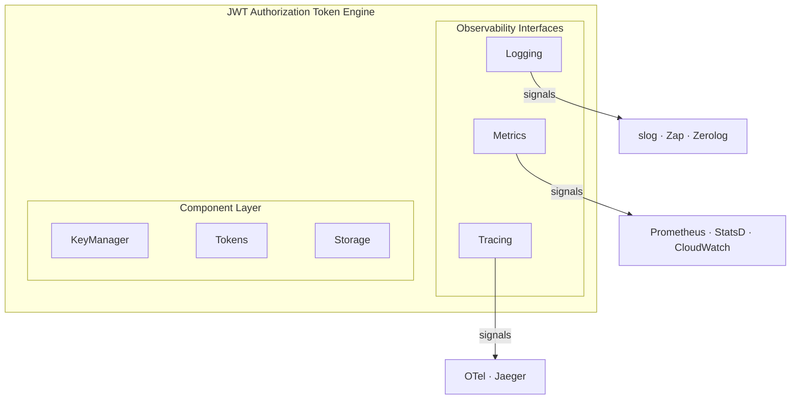

# jwtauth — Stateful JWT Authorization Token Engine

This document explains the design decisions, patterns, and principles used in the JWT authorization token engine.

## Table of Contents

- [Overview](#overview)
- [Design Principles](#design-principles)
- [Project Structure](#project-structure)
- [Observability Architecture](#observability-architecture)
- [Dependency Inversion](#dependency-inversion)
- [Component Architecture](#component-architecture)
- [Testing Strategy](#testing-strategy)
- [Future Roadmap](#future-roadmap)

---

## Overview

jwtauth is designed as a production-ready, highly observable, and testable **stateful** JWT authorization token engine for Go applications. It manages the stateful machinery that production token systems require — cryptographic key generation and zero-downtime rotation, access token issuance and validation, and refresh token lifecycle with revocation support. Identity verification is intentionally out of scope.

### Key Features

- **Zero-downtime key rotation** with configurable overlap periods
- **Automatic background rotation** with cleanup
- **Structured logging** for log aggregation (ELK, Loki, Splunk)
- **Domain-specific metrics** for monitoring and alerting
- **Thread-safe** concurrent operations
- **Graceful shutdown** with proper resource cleanup
- **Comprehensive test coverage** with race detection

---

## Design Principles

### 1. Dependency Inversion Principle (SOLID)

> High-level modules should not depend on low-level modules. Both should depend on abstractions.

**Applied**:
- Components depend on `logging.Logger` interface, not specific loggers
- Components depend on `metrics.Metrics` interface, not specific metrics systems
- Easy to swap implementations without changing component code

**Example**:
```go
// KeyManager depends on abstractions, not concrete implementations
type KeyManagerConfig struct {
    Logger  logging.Logger   // Interface, not *slog.Logger
    Metrics metrics.Metrics  // Interface, not *PrometheusMetrics
}
```

### 2. Single Responsibility Principle

Each package has one clear responsibility:
- `pkg/keys` - RSA key generation, rotation, and management
- `pkg/logging` - Logging abstraction and adapters
- `pkg/metrics` - Metrics abstraction and implementations
- `pkg/tracing` - Distributed tracing abstraction and OTel adapter
- `pkg/tokens` - JWT token creation, validation, and lifecycle management
- `pkg/storage` - Refresh token persistence (memory, Redis, extensible)

### 3. Interface Segregation

Interfaces are small and focused:
- `Logger` - Only 4 methods (Debug, Info, Warn, Error)
- `Metrics` - Domain-specific methods, not generic
- Easy to implement, test, and maintain

### 4. Don't Repeat Yourself (DRY)

Shared interfaces prevent duplication:
- One `Logger` interface for all components
- One `MockLogger` for all tests
- One set of adapters reused everywhere

### 5. YAGNI (You Aren't Gonna Need It)

Build what's needed now:
- No interfaces until multiple implementations exist
- Metrics interface defined, but implementations added as needed
- Logger interface evolved from Info/Warn/Error to include Debug for development tracing

---

## Project Structure

| Package | Purpose | Status |
|---------|---------|--------|
| `pkg/keys` | Cryptographic key lifecycle, rotation, JWKS generation | ✅ Stable |
| `pkg/tokens` | JWT token issuance and validation | 🟡 Beta |
| `pkg/storage` | Refresh token storage — memory and Redis backends | ✅ Stable |
| `pkg/logging` | Logging abstraction with slog adapter | ✅ Stable |
| `pkg/metrics` | Metrics abstraction with Prometheus implementation | ✅ Stable |
| `pkg/tracing` | Distributed tracing abstraction with OTel adapter | ✅ Stable |

`internal/testutil` holds shared mocks and test utilities — not part of the public API.

> ✅ **Stable** — no breaking changes planned before v1.0.
> 🟡 **Beta** — core operations complete; API may change before v1.0.

---

## Observability Architecture

### Design Goal

**Unified observability across all components with zero coupling to specific implementations.**

### Three Pillars



### Logging

**Interface**: `pkg/logging/Logger`

**Design Decisions**:
- **4 levels** (Debug, Info, Warn, Error) - stratified by use case
- **Structured** (key-value pairs) - machine-readable
- **Optional** — pass `nil` to default to `NoOpLogger`; call sites invoke unconditionally
- **stdlib adapter** (slog) - no external dependencies

**Log Levels by Purpose**:

| Level | Use Case | Examples |
|-------|----------|----------|
| **Debug** | Development & troubleshooting | Entry points, cache hits/misses, intermediate state, "no-op" outcomes |
| **Info** | Terminal outcomes | Token issued, key rotated, cleanup completed |
| **Warn** | Expected but notable conditions | Empty inputs, missing tokens, expired items, context cancellation |
| **Error** | Failures requiring attention | I/O errors, invalid state, operation failures |

**Debug Usage Pattern**:
```go
// High-frequency read operations (cache lookups, token validation entry)
m.config.Logger.Debug("public key cache hit", "keyID", keyID)

// Intermediate steps in loops (per-token operations)
m.logger.Debug("revoking token for user",
    "tokenID", tokenID,
    "userID", userID)

// No-op outcomes (nothing to do during cleanup)
m.logger.Debug("no expired keys found during cleanup")
```

**Flow**:
```go
KeyManager → logging.Logger interface → SlogAdapter → os.Stdout → K8s logs
```

**Why this design**:
- ✅ Kubernetes logs picked up automatically (stdout/stderr)
- ✅ JSON format for log aggregators (ELK, Loki, Splunk)
- ✅ Flexible (swap logger without changing code)
- ✅ Testable (MockLogger)
- ✅ Debug level disableable in production (disable at handler, not in code)

**Correlation ID**:

All jwtauth components accept `context.Context` on every operation and pass it as the first element of `keysAndValues` when logging. `SlogAdapter` detects this and routes the call through `slog.*Context()`, which lets `CorrelationIDHandler` extract a correlation ID from the context and append it to every record automatically.

```go
// Internal component logging — ctx as the first kwarg:
m.config.Logger.Info("key rotation successful",
    ctx,
    "keyID", newKeyID,
    "duration", time.Since(start))

// SlogAdapter calls InfoContext(ctx, ...), CorrelationIDHandler injects the field:
// → {"msg":"key rotation successful","keyID":"abc","correlation_id":"req-001"}
```

Wire it at application startup:

```go
// NewCorrelationJSONLogger wraps slog.NewJSONHandler with CorrelationIDHandler.
logger := logging.NewCorrelationJSONLogger(slog.LevelInfo)

mgr, _ := tokens.NewManager(tokens.TokenManagerConfig{Logger: logger, ...})
```

Inject the ID once at the HTTP request boundary — it propagates to all jwtauth calls for that request:

```go
ctx := logging.WithCorrelationID(r.Context(), r.Header.Get("X-Correlation-ID"))
accessToken, _, err := mgr.IssueTokenPair(ctx, userID)
```

See `examples/correlation-example/` for a complete working demonstration.

### Metrics

**Interface**: `pkg/metrics/Metrics`

**Design Decisions**:
- **Generic primitives** (counters, gauges, histograms, durations) with label maps — backend-agnostic
- **Optional** — pass `nil` to default to `NoOpMetrics`; call sites invoke unconditionally
- **Pre-registration at construction** — naming conflicts caught early, not at observation time
- **Graceful label handling** — wrong or missing labels log a warning and skip rather than panic

**Interface**:
```go
type Metrics interface {
    IncrementCounter(name string, labels map[string]string)
    AddCounter(name string, value float64, labels map[string]string)
    SetGauge(name string, value float64, labels map[string]string)
    RecordHistogram(name string, value float64, labels map[string]string)
    RecordDuration(name string, duration time.Duration, labels map[string]string)
}
```

**Implementations**:
- `PrometheusMetrics` — Prometheus client, isolated registry, OpenMetrics `/metrics` handler, 100% test coverage
- `NoOpMetrics` — zero overhead no-op for when metrics are disabled

**PrometheusMetrics pre-registered metrics** (grouped by component):

| Metric | Type | Labels |
|--------|------|--------|
| `jwtauth_tokens_issued_total` | Counter | status, error_type |
| `jwtauth_tokens_validated_total` | Counter | status, error_type |
| `jwtauth_tokens_refreshed_total` | Counter | status, error_type |
| `jwtauth_tokens_revoked_total` | Counter | operation, status |
| `jwtauth_tokens_introspected_total` | Counter | status |
| `jwtauth_tokens_list_total` | Counter | namespace, error_type |
| `jwtauth_tokens_list_duration_seconds` | Histogram | namespace |
| `jwtauth_tokens_list_for_user_total` | Counter | namespace, error_type |
| `jwtauth_tokens_list_for_user_duration_seconds` | Histogram | namespace |
| `jwtauth_operations_total` | Counter | operation, status |
| `jwtauth_operation_duration_seconds` | Histogram | operation |
| `jwtauth_active_tokens` | Gauge | storage_backend |
| `jwtauth_service_running` | Gauge | — |
| `jwtauth_storage_operations_total` | Counter | operation, status, error_type, storage_backend |
| `jwtauth_storage_cleanup_tokens_removed_total` | Counter | storage_backend |
| `jwtauth_storage_operation_duration_seconds` | Histogram | operation, storage_backend |
| `jwtauth_storage_tokens_count` | Gauge | storage_backend |
| `jwtauth_storage_list_tokens_total` | Counter | storage_backend, namespace, error_type |
| `jwtauth_storage_list_tokens_duration_seconds` | Histogram | storage_backend, namespace |
| `jwtauth_storage_list_tokens_for_user_total` | Counter | storage_backend, namespace, error_type |
| `jwtauth_storage_list_tokens_for_user_duration_seconds` | Histogram | storage_backend, namespace |
| `jwtauth_keystore_operations_total` | Counter | operation, status, error_type, storage_backend |
| `jwtauth_keystore_operation_duration_seconds` | Histogram | operation, storage_backend |
| `jwtauth_keystore_keys_count` | Gauge | storage_backend |
| `jwtauth_key_rotations_total` | Counter | status, error_type |
| `jwtauth_key_signing_operations_total` | Counter | status, error_type |
| `jwtauth_key_validation_operations_total` | Counter | status, error_type |
| `jwtauth_key_operation_duration_seconds` | Histogram | operation |
| `jwtauth_key_current_version` | Gauge | — |
| `jwtauth_key_active_versions_count` | Gauge | — |

> **`error_type` label convention**: `""` (empty string) on success; mirrors the `status` value on failure (e.g., `"cancelled"`, `"not_found"`, `"validation_error"`). Enables two-level dashboarding — success/failure rate at the `status` level, failure breakdown at the `error_type` level. Aligned with the OpenTelemetry `error.type` semantic convention.

### Integration Pattern

Every component accepts optional observability:

```go
type KeyManagerConfig struct {
    // Core configuration
    KeyStore            KeyStore        // Required: injected key persistence backend
    KeyRotationInterval time.Duration
    
    // Observability (optional)
    Logger  logging.Logger   // Can be nil
    Metrics metrics.Metrics  // Can be nil
}

// Usage
func (m *Manager) RotateKeys(ctx context.Context) error {
    start := time.Now()
    
    // Rotate logic...
    
    // Optional logging — ctx is the first kwarg so SlogAdapter routes through
    // InfoContext, which lets CorrelationIDHandler inject correlation_id.
    if m.config.Logger != nil {
        m.config.Logger.Info("key rotation successful",
            ctx,
            "keyID", newKeyID,
            "duration", time.Since(start))
    }
    
    // Optional metrics
    if m.config.Metrics != nil {
        m.config.Metrics.IncrementCounter("jwtauth_key_rotations_total",
            map[string]string{"status": "success"})
        m.config.Metrics.RecordDuration("jwtauth_key_operation_duration_seconds",
            time.Since(start), map[string]string{"operation": "rotate"})
    }
    
    return nil
}
```

### Distributed Tracing

**Interface**: `pkg/tracing/Tracer`

**Design Decisions**:
- **Thin abstraction** — `Tracer` and `Span` interfaces wrap OTel concepts without importing the OTel SDK in the core library
- **Always non-nil** — every constructor applies `NoOpTracer` as default; no nil checks required in method bodies
- **`startSpan` helper per component** — encapsulates span naming prefix so all spans follow `<TypeName>.<MethodName>` convention without repetition

**Interface**:
```go
type Tracer interface {
    Start(ctx context.Context, name string, opts ...SpanOption) (context.Context, Span)
}

type Span interface {
    End()
    SetAttribute(key string, value any)
    SetStatus(code StatusCode, description string)
    RecordError(err error)
}
```

**Implementations**:
- `NoOpTracer` / `NoOpSpan` — zero-allocation, race-detection clean; used as default in all constructors
- `OtelTracer` — bridges `pkg/tracing.Tracer` to `go.opentelemetry.io/otel`; initialized with `tracing.NewOtelTracer("scope")`

**Span naming convention**: `<TypeName>.<MethodName>` — e.g., `TokenManager.IssueAccessToken`, `DiskKeyStore.Save`

**Span attributes by layer**:

| Component | Attributes |
|-----------|-----------|
| `DiskKeyStore` / `RedisKeyStore` | `storage.backend` (`"disk"` / `"redis"`), `key_id` |
| `MemoryRefreshStore` / `RedisRefreshStore` | `storage.backend` (`"memory"` / `"redis"`), `token_id` |
| `KeyManager` | `key_id` |
| `TokenManager` | `user_id`, `token_id`, `active` (IntrospectToken), `deleted_count` (CleanupExpiredTokens) |

**Status conventions**: `StatusOK` on all success paths; `RecordError(err)` + `StatusError` on all error paths. Wrapped errors (via `fmt.Errorf("...: %w", err)`) are passed to `RecordError` so the full message propagates to the trace backend.

**Integration Pattern** — every component follows the same shape:
```go
type DiskKeyStore struct {
    tracer tracing.Tracer // never nil; defaults to NoOpTracer
}

func (d *DiskKeyStore) startSpan(ctx context.Context, op string, opts ...tracing.SpanOption) (context.Context, tracing.Span) {
    return d.tracer.Start(ctx, "DiskKeyStore."+op, opts...)
}

func (d *DiskKeyStore) Save(ctx context.Context, key *KeyInfo) error {
    ctx, span := d.startSpan(ctx, "Save")
    defer span.End()
    // ...
    span.SetAttribute("key_id", key.ID)
    span.SetStatus(tracing.StatusOK, "")
    return nil
}
```

---

## Dependency Inversion

### Problem Without Dependency Inversion

```go
// ❌ Bad: Direct coupling to concrete implementation
import "github.com/uber-go/zap"

type Manager struct {
    logger *zap.Logger  // Tightly coupled!
}

// Issues:
// - Can't swap logger without changing Manager
// - Hard to test (real logger in tests)
// - Forces all users to use Zap
```

### Solution With Dependency Inversion

```go
// ✅ Good: Depends on abstraction
import "github.com/aetomala/jwtauth/pkg/logging"

type Manager struct {
    logger logging.Logger  // Interface!
}

// Benefits:
// - Easy to swap (slog, Zap, Zerolog, NoOp)
// - Easy to test (MockLogger)
// - Users choose their logger
```

### Dependency Flow

```
High-Level Module (KeyManager)
        ↓ depends on
    Abstraction (logging.Logger interface)
        ↑ implements
Low-Level Module (SlogAdapter, ZapAdapter, etc.)
```

**Key Insight**: The dependency points **upward** (adapter implements interface), not downward (KeyManager doesn't import adapter).

---

## Component Architecture

### KeyManager

**Responsibilities**:
- Generate RSA key pairs
- Rotate keys on schedule
- Maintain overlap period (old + new keys valid simultaneously)
- Cleanup expired keys
- Delegate key persistence to an injected `KeyStore`
- Provide JWKS endpoint

**State Machine**:
```
Created → Start() → Running → Shutdown() → Stopped
                      ↓
                   Rotating (concurrent with Running)
                      ↓
                   Cleanup (concurrent with Running)
```

**Concurrency Model**:
- **Main goroutine**: User requests (GetCurrentSigningKey, RotateKeys, etc.)
- **Rotation goroutine**: Background scheduler, fires every N days
- **Cleanup goroutine**: Separate ticker, checks every N minutes
- **Synchronization**: RWMutex for key map, atomic for state

**Key Rotation Timeline**:
```
Day 0:    Key A (current)
Day 30:   Rotate → Key A (expires in 1 hour), Key B (current)
Day 30+1h: Key A deleted, Key B (current)
Day 60:   Rotate → Key B (expires in 1 hour), Key C (current)
```

**KeyStore Interface**:

`Manager` delegates all I/O to an injected `KeyStore`, keeping the two concerns separate:

```go
type KeyStore interface {
    LoadAll(ctx context.Context) ([]*StoredKey, error)
    Save(ctx context.Context, keyID string, privateKey *rsa.PrivateKey, meta KeyMetadata) error
    UpdateMetadata(ctx context.Context, keyID string, meta KeyMetadata) error
    LoadKey(ctx context.Context, keyID string) (*rsa.PrivateKey, *KeyMetadata, error)
    Delete(ctx context.Context, keyID string) error
}
```

This enables:
- **Single-instance deployments**: `DiskKeyStore` (PEM + JSON files, local filesystem)
- **Distributed deployments**: `RedisKeyStore` (shared Redis backend, horizontal scale)
- **Testing**: `MockKeyStore` (gomock, no I/O in Manager unit tests)

**DiskKeyStore**:

```go
ks, err := keys.NewDiskKeyStore("./keys", 2048, logger, metrics)
km, err := keys.NewManager(keys.KeyManagerConfig{
    KeyStore: ks,
    Logger:   logger,
})
```

File format:
```
{dir}/{keyID}.pem   — PKCS#1 RSA private key, 0600 permissions
{dir}/{keyID}.json  — {"id":"…","created_at":"…","expires_at":"…"}
```

**RedisKeyStore**:

```go
client := redis.NewClient(&redis.Options{Addr: "redis:6379"})
ks, err := keys.NewRedisKeyStore(client, logger, metrics)
km, err := keys.NewManager(keys.KeyManagerConfig{
    KeyStore: ks,
    Logger:   logger,
})
```

Redis data layout:
```
[KeyPrefix]ks:pem:<keyID>   — PKCS#1 PEM-encoded RSA private key (string)
[KeyPrefix]ks:meta:<keyID>  — JSON-encoded KeyMetadata (string)
```

Keys are optionally prefixed by `RedisKeyStoreConfig.KeyPrefix` (defaults to empty string — preserves current layout). Keys carry no TTL — Manager owns the lifecycle and calls `Delete` explicitly via `cleanupExpiredKeys`. `LoadAll` uses `SCAN {KeyPrefix}ks:pem:*` to enumerate all stored keys, scoping enumeration to the configured namespace. `Save` writes both entries via a Redis Pipeline, so either both succeed or both fail — no partial state and no rollback code needed.

`ErrNilRedisClient` is returned by the constructor if client is nil. All other sentinel errors (`ErrKeyStoreKeyNotFound`, `ErrKeyStoreInvalidKeyID`) are shared with `DiskKeyStore` and defined in `keystore.go`.

**KeyStore Metrics** (both implementations, same names):

| Metric | Type | Labels |
|--------|------|--------|
| `jwtauth_keystore_operations_total` | Counter | `operation`, `status`, `storage_backend` |
| `jwtauth_keystore_operation_duration_seconds` | Histogram | `operation`, `storage_backend` |
| `jwtauth_keystore_keys_count` | Gauge | `storage_backend` |

`operation` values: `"load_all"`, `"save"`, `"update_metadata"`, `"load_key"`, `"delete"`

**Key Inspection API**

`GetKeyInfo(ctx, keyID)` and `GetCurrentKeyInfo(ctx)` return a `*KeyInfo` struct containing public metadata only — no private key material is exposed:

```go
type KeyInfo struct {
    KeyID       string    // Unique key identifier
    CreatedAt   time.Time // When the key was generated
    RotateAt    time.Time // Estimated rotation time (current key only; zero for historical keys)
    ExpiresAt   time.Time // When the key expires (zero = still current)
    KeySizeBits int       // RSA key size in bits (e.g., 2048)
    Algorithm   string    // Always "RS256"
    IsCurrent   bool      // True if this is the active signing key
    IsValid     bool      // True if the key has not yet expired
}
```

`RotateAt` is computed as `CreatedAt + KeyRotationInterval` for the current signing key — it is not stored. Both methods check context cancellation before acquiring the read lock, consistent with all other KeyManager read methods.

Use cases:
- `/health/keys` endpoints — expose key age and upcoming rotation schedule
- Prometheus gauges — `jwtauth_key_age_seconds`, `jwtauth_rotation_scheduled_seconds`, `jwtauth_key_valid`
- Admin dashboards — display key rotation state without exposing cryptographic material
- Debug — correlate a `kid` JWT header claim with key metadata

`status` values: `"success"`, `"not_found"`, `"error"`, `"cancelled"`

`storage_backend` values: `"disk"`, `"redis"`

`SetGauge(jwtauth_keystore_keys_count)` is recorded only by `LoadAll` — set to the count of valid non-expired keys returned. This is sufficient because `GetCurrentSigningKey` never calls the store after startup and `GetPublicKey` only calls `LoadKey` on rare cache misses, so KeyStore operations are not on the hot path.

### TokenManager (Beta)

**Responsibilities**:
- Issue access tokens (short-lived, e.g., 15 minutes) with optional custom claims
- Issue refresh tokens (long-lived, e.g., 30 days) with optional metadata
- Issue coordinated token pairs (access + refresh in one call)
- Validate access tokens (signature, expiration, issuer, audience)
- Rotate tokens via refresh flow with expiration and revocation checks
- Revoke single or all tokens for a user
- Introspect token status per RFC 7662
- Sign tokens with current key from KeyManager

**State Machine**:
```
Created → Start() → Running → Shutdown() → Stopped
                      ↓
                   Background cleanup goroutine (configurable interval)
```

**Concurrency Model**:
- **User goroutines**: Token operations (IssueAccessToken, ValidateAccessToken, etc.)
- **Cleanup goroutine**: Background ticker deletes expired refresh tokens from store
- **Synchronization**: `atomic.Bool` for running state; cleanup uses channel signaling and `sync.WaitGroup` for graceful shutdown

**Key Design Decisions**:
- Rate limiting is intentionally **not** in TokenManager — it belongs at the infrastructure layer (API Gateway, Ingress, Load Balancer) where per-route and per-IP policies apply globally
- All storage operations accept `context.Context` for cancellation propagation
- Reserved JWT claims (`sub`, `iss`, `aud`, `exp`, `iat`, `jti`) cannot be overridden by custom claims

### RefreshTokenStore

**Responsibilities**:
- Store refresh tokens with expiration and revocation tracking
- Retrieve tokens with validation checks (expiry, revocation)
- Revoke individual or bulk tokens (by userID)
- Enumerate all tokens or tokens for a specific user via cursor-based pagination (`ListTokens`, `ListTokensForUser`)
- Clean up expired tokens
- Maintain lookups optimized for each implementation

**Implementations**:

#### MemoryRefreshStore (In-Process, Testing & Single-Instance) ✅

**Design**:
```go
type MemoryRefreshStore struct {
    mu         sync.RWMutex             // Thread safety
    tokens     map[string]*RefreshToken // tokenID → token
    userTokens map[string][]string      // userID → []tokenID (for bulk ops)
    logger     logging.Logger           // never nil; defaults to NoOpLogger
    metrics    metrics.Metrics          // never nil; defaults to NoOpMetrics
    backend    string                   // storage_backend label value; always "memory"
}
```

**Key Features**:
- **Dual-index data structure**: `tokens` map for O(1) lookup, `userTokens` slice for O(1) bulk revocation and insertion-order enumeration
- **Cursor-based enumeration**: `ListTokens` iterates all tokens; `ListTokensForUser` iterates a single user's tokens — both use integer offsets as cursors for stable, allocation-free pagination
- **Defensive copying**: Metadata and token structs isolated from caller mutations
- **RWMutex locking**: RLock for Retrieve and listing (concurrent reads), Lock for mutations
- **Idempotent operations**: Revoke returns nil if token doesn't exist
- **Expiration/Revocation checks**: Retrieve validates expiry and revocation at request time
- **Cleanup**: Removes expired tokens from both maps and userTokens index
- **Context propagation**: All operations respect context.Context cancellation
- **Structured logging**: Warn for validation failures, Info for successful ops
- **Metrics instrumentation**: Counter + duration recorded on every exit path; token-count gauge updated on Store and Cleanup
- **Thread-safe**: Read operations concurrent, write operations exclusive

#### RedisRefreshStore (Distributed, Multi-Instance) ✅

**Design**:
```go
type RedisRefreshStore struct {
    client  *redis.Client   // go-redis/v9 client (internally thread-safe)
    logger  logging.Logger  // never nil; defaults to NoOpLogger
    metrics metrics.Metrics // never nil; defaults to NoOpMetrics
    backend string          // storage_backend label value; always "redis"
}
```

**Redis Data Structure**:
```
[KeyPrefix]tokens:{tokenID}        → Hash with fields: userID, expiresAt, createdAt, revoked, metadata
[KeyPrefix]user_tokens:{userID}    → Set of tokenIDs for that user
```

Keys are optionally prefixed by `RedisRefreshStoreConfig.KeyPrefix`. `Cleanup` scans only `{KeyPrefix}tokens:*` — expired tokens from other namespaces are not affected.

**Key Features**:
- **Distributed**: Works across multiple instances (Redis is the shared backend)
- **Cursor-based enumeration**: `ListTokens` uses `SCAN` over the token hash namespace; `ListTokensForUser` uses `SSCAN` over the per-user token set — both pass Redis cursors through directly for stable pagination without extra round-trips
- **Pipeline atomicity**: Multi-operation transactions via Redis pipelines
- **Millisecond-precision timestamps**: Stored as UnixMilli (preserves precision across serialization)
- **Efficient cleanup**: SCAN-based key iteration for expired token sweeps
- **TTL management**: Token keys automatically expire via Redis EXPIRE
- **Context propagation**: All operations respect context.Context cancellation
- **Structured logging**: Same error/info patterns as MemoryRefreshStore
- **Thread-safe**: go-redis/v9 client is internally thread-safe
- **Error handling**: Proper error wrapping with context

**Why Redis?**:
- ✅ Shared state across service instances (no distributed consensus issues)
- ✅ TTL-based automatic cleanup (keys expire automatically)
- ✅ Atomic transactions via pipelines
- ✅ Familiar operations (HSet, SAdd, SRem, Scan)
- ✅ Production-proven (widely used in Go services)

**Common Features** (Both Implementations):

| Aspect | Details |
|--------|---------|
| **Error Handling** | `ErrInvalidTokenID` / `ErrInvalidUserID`, `ErrInvalidCursor`, `ErrTokenNotFound`, `ErrTokenExpired`, `ErrTokenRevoked` |
| **Validation** | Empty/whitespace input rejection, expiry checks, revocation checks |
| **Enumeration** | `ListTokens(ctx, cursor, count)` for global iteration; `ListTokensForUser(ctx, userID, cursor, count)` for user-scoped iteration — both use best-effort cursors; pass `""` to start from the beginning |
| **Idempotence** | Revoke returns nil if token doesn't exist (safe to call multiple times) |
| **Context** | Full support for context.Context cancellation propagation |
| **Logging** | Structured key-value logs with operation names and fields |
| **Metrics** | Counter + duration on every operation; cleanup records removed count and token-count gauge; dedicated counters + histograms for each list operation |
| **Testing** | Identical comprehensive test suite (77 tests per implementation, 154 total) |

#### Storage Metrics Instrumentation

Every public method records two metrics unconditionally, regardless of outcome:

| Metric | Type | When recorded |
|--------|------|---------------|
| `jwtauth_storage_operations_total` | Counter | Every exit path — success, validation error, not found, etc. |
| `jwtauth_storage_operation_duration_seconds` | Histogram | Every exit path — full method duration including lock wait |

Cleanup additionally records:

| Metric | Type | When recorded |
|--------|------|---------------|
| `jwtauth_storage_cleanup_tokens_removed_total` | Counter | Cleanup success only — value is the removed count |
| `jwtauth_storage_tokens_count` | Gauge | Cleanup success (both backends); Store success (Memory only — see below) |

**Status label values** for `jwtauth_storage_operations_total`:

| Value | Meaning |
|-------|---------|
| `success` | Operation completed normally |
| `validation_error` | Input rejected (empty ID, expired token at write time) |
| `not_found` | Token does not exist in storage |
| `revoked` | Token exists but has been revoked |
| `expired` | Token exists but has passed its expiry |
| `cancelled` | Context was cancelled before the operation began |
| `error` | Unexpected backend failure (Redis pipeline error, marshal error, scan error) |

Separating `cancelled` from `error` allows clean alerting: a spike in `error` indicates a backend problem; a spike in `cancelled` indicates client timeouts or graceful shutdown — two different on-call responses.

**Recording pattern** — deferred closure with a captured `status` variable:

```go
func (m *MemoryRefreshStore) Store(ctx context.Context, ...) error {
    start := time.Now()
    status := "error"          // default; overwritten at each return point
    defer func() {
        m.metrics.IncrementCounter(metricStorageOpsTotal, map[string]string{
            "operation": "store", "status": status, "storage_backend": m.backend,
        })
        m.metrics.RecordDuration(metricStorageOpDuration, time.Since(start), ...)
    }()
    // ...
    status = "validation_error"
    return ErrInvalidTokenID
    // ...
    status = "success"
    return nil
}
```

**Token-count gauge asymmetry**:

`MemoryRefreshStore` updates `jwtauth_storage_tokens_count` on every successful `Store` call because `len(m.tokens)` is O(1) and available while the write lock is already held. This gives a real-time count.

`RedisRefreshStore` only updates the gauge during `Cleanup` because an exact live count would require a separate `DBSIZE` or `SCAN` command — an additional network round-trip that is not justified for a gauge update on an already-costly write path. The gauge is therefore a post-cleanup snapshot for Redis.

**Metric name constants** — all four metric names are defined once in `pkg/storage/observability.go` and referenced by both implementations:

```go
const (
    metricStorageOpsTotal     = "jwtauth_storage_operations_total"
    metricStorageOpDuration   = "jwtauth_storage_operation_duration_seconds"
    metricStorageRemovedTotal = "jwtauth_storage_cleanup_tokens_removed_total"
    metricStorageTokensCount  = "jwtauth_storage_tokens_count"
)
```

A typo in a string literal silently drops data; a typo in a constant reference fails to compile.

**Hot-path performance consideration** — label map allocations:

`Store` and `Retrieve` are on the hot path. Every call currently allocates two `map[string]string` inside the deferred closure for the `operation`/`status`/`storage_backend` label sets. At high throughput (tens of thousands of operations/second) this creates sustained GC pressure.

*Why it is not yet addressed*: The allocation is O(1) and tiny relative to what it measures — a `sync.RWMutex` acquire + map write for Memory, or a Redis pipeline round-trip for Redis. Profiling is required before optimizing.

*Possible mitigations when profiling confirms it is a bottleneck*:

1. **Pre-allocate per-status label maps at construction** — since `operation` and `storage_backend` are fixed per method, build one `map[string]string` per `(operation, status)` pair once in the constructor and reuse them. There are 5 operations × 7 status values = 35 maps maximum, all constant after `New...`. No allocation on the hot path at all.

2. **`sync.Pool` for label maps** — pool map instances and reset/return them after `IncrementCounter`/`RecordDuration` complete. Works for any backend but requires the `Metrics` implementation to not retain the map beyond the call.

3. **Promote to `PrometheusMetrics` internals** — bypass the `map[string]string` interface entirely for the storage hot path by holding pre-resolved `prometheus.Counter` and `prometheus.Histogram` handles directly in the store struct. This is the most efficient option but breaks the abstraction and couples the store to Prometheus.

The right choice depends on profiled evidence. Start with option 1 if the benchmark shows label-map allocation is significant; it requires no interface changes and has no trade-offs.

#### Shared Test Suite Pattern

**Problem Solved**: Without shared testing, maintaining two implementations risks:
- Test divergence (Memory tests differ from Redis tests)
- Duplicate test code (800+ lines of duplication)
- Inconsistent semantics (implementations evolve differently)

**Solution**: Single parameterized test suite runs against all implementations:

```go
// suite_test.go defines 77 comprehensive tests across 13 phases
// StoreFactory accepts optional MockMetrics — nil for phases 1–9, live mock for Phase 10
type StoreFactory func(logger *testutil.MockLogger, m metrics.Metrics) storage.RefreshStore

func RunRefreshStoreTests(description, backend string, factory StoreFactory, cleanup CleanupFunc) bool {
    Describe(description, func() {
        // Phases 1–9: functional correctness (nil metrics)
        // Phase 10:   metrics recording assertions (MockMetrics via gomock)
    })
}

// memory_test.go uses the suite
var _ = RunRefreshStoreTests(
    "MemoryRefreshStore", "memory",
    func(logger *testutil.MockLogger, m metrics.Metrics) storage.RefreshStore {
        return storage.NewMemoryRefreshStore(logger, m)
    },
    nil,
)

// redis_test.go uses the same suite
var _ = RunRefreshStoreTests(
    "RedisRefreshStore", "redis",
    func(logger *testutil.MockLogger, m metrics.Metrics) storage.RefreshStore {
        mini, _ := miniredis.Run()
        return storage.NewRedisRefreshStore(redis.NewClient(...), logger, m)
    },
    func() { mini.FlushAll() },
)
```

**Benefits**:
- ✅ Both implementations pass identical tests (semantic equivalence)
- ✅ No duplication (single suite shared by all)
- ✅ Phase 10 uses gomock to assert exact metric calls per operation and status label
- ✅ Easy to add new implementations (add a new file calling `RunRefreshStoreTests`)
- ✅ Reduces maintenance burden (update tests once, benefits both)

---

## Testing Strategy

### Test Organization

Tests organized by **concern**, not **chronology**:

```go
Describe("KeyManager", func() {
    // Phase 1: Constructor
    // Phase 2: Start
    // Phase 3: Core Operations
    // ...
})

Describe("KeyManager Shutdown", func() {
    // Separate suite for shutdown behavior
})

Describe("KeyManager Persistence", func() {
    // Separate suite for disk operations
})

Describe("KeyManager Logging", func() {
    // Separate suite for logging behavior
})

Describe("MemoryRefreshStore", func() {
    // Phase 1: Constructor
    // Phase 2: Happy paths (Store, Retrieve)
    // Phase 2.5: Context cancellation
    // Phase 3: Input validation
    // Phase 4: Defensive programming
    // Phase 5: Contract compliance
    // Phase 6: Concurrency safety
    // Phase 7: Core methods
    // Phase 8: Edge cases
})
```

### Progressive Phase-Based Testing

Each phase builds on the previous:

```
Phase 1: Constructor
  ↓ Test passes
Phase 2: Start/Initialization  
  ↓ Test passes
Phase 3: Core Operations
  ↓ Test passes
Phase 4: JWKS
  ↓ Test passes
Phase 5: Manual Rotation
  ↓ Test passes
Phase 6: Automatic Rotation
  ↓ Test passes
Phase 7: Concurrency
```

**Benefits**:
- Small increments (easy to debug)
- Always have working code
- Clear checkpoints

### Test Utilities

**Shared MockLogger** (`internal/testutil/mock_logger.go`):
- Thread-safe log recording
- Query helpers (HasLog, CountLogs, etc.)
- Reusable across all component tests

**Usage**:
```go
ctrl      := gomock.NewController(GinkgoT())
mockLogger := testutil.NewMockLogger()
mockKS     := testutil.NewMockKeyStore(ctrl)

mockKS.EXPECT().LoadAll(gomock.Any()).Return([]*keys.StoredKey{}, nil)

manager, _ := keys.NewManager(keys.KeyManagerConfig{
    KeyStore: mockKS,
    Logger:   mockLogger,
})

manager.Start(ctx)

// Verify
Expect(mockLogger.HasLog("info", "key manager started")).To(BeTrue())
```

### Race Detection

All tests run with race detector:
```bash
ginkgo -race ./...
```

Catches:
- Concurrent map access
- Unsynchronized atomic operations
- Channel races

---

## Roadmap

### Phase 1: Logging ✅
- ✅ Logger interface defined
- ✅ Slog adapter implemented
- ✅ KeyManager integrated
- ✅ Tests comprehensive

### Phase 2: Metrics ✅
- ✅ Metrics interface defined
- ✅ Prometheus implementation (`PrometheusMetrics`) with 22 pre-registered metrics, 100% test coverage
- ✅ NoOp implementation
- ✅ gomock `MockMetrics` for dependency injection in tests
- ✅ Wired into KeyManager, TokenManager, and RefreshStore — all components fully instrumented

### Phase 3: TokenManager ✅ (Beta)
- ✅ JWT creation with RS256 signing and custom claims
- ✅ Access token validation (signature, expiration, issuer, audience)
- ✅ Refresh token rotation with revocation checks
- ✅ Single and bulk token revocation
- ✅ Token introspection per RFC 7662
- ✅ Lifecycle management (Start/Shutdown/IsRunning)
- ✅ Background cleanup goroutine with configurable interval
- ✅ Clock skew tolerance (`ClockSkew time.Duration` in `TokenManagerConfig` — `jwt.WithLeeway()` integration)
- ✅ `ValidateAccessTokenWithClaims` — returns registered claims and custom claims map after validation
- ✅ Comprehensive test coverage (153 tests, ~87% coverage, race-detection clean)
- ✅ RefreshStore interface with context propagation

### Phase 4: RefreshToken Storage Implementations ✅
- ✅ RefreshStore interface defined (pkg/storage)
- ✅ MemoryRefreshStore (in-process, testing + single-instance deployments)
  - Dual-index design for O(1) lookups and bulk operations
  - Defensive copying for metadata isolation
  - 51 comprehensive tests with 100% statement coverage
- ✅ RedisRefreshStore (distributed, multi-instance deployments)
  - Pipeline-based atomic operations
  - Millisecond-precision timestamp handling
  - Efficient SCAN-based cleanup
  - 51 comprehensive tests (identical suite as Memory)
- ✅ Shared test suite pattern (eliminates 800+ lines of duplication)
  - Single parameterized suite runs against all implementations
  - Ensures semantic equivalence across backends
  - Easy to add new implementations

### Phase 5: Metrics Wiring and KeyStore Abstraction ✅ Complete
- ✅ Prometheus adapter with `/metrics` endpoint (`PrometheusMetrics`)
- ✅ `MemoryRefreshStore` and `RedisRefreshStore` fully instrumented
  - Counter + duration on every operation exit path
  - `"cancelled"` status distinct from `"error"` for context cancellation
  - Token-count gauge updated in real time on Memory `Store`; post-cleanup for Redis
  - Metric name constants centralised in `pkg/storage/observability.go`
  - Phase 10 test suite verifies exact metric calls via gomock
- ✅ `KeyStore` interface extracted from `Manager` — `DiskKeyStore` implementation with full metrics
  - `Manager` unit tests are now filesystem-free (use `MockKeyStore`)
  - 44 Manager specs + 38 DiskKeyStore specs (9 phases), all race-clean
  - `MockKeyStore` generated via gomock
- ✅ Wire `PrometheusMetrics` into TokenManager — deferred closure pattern with `error_type` label, context propagation
- ✅ `RedisKeyStore` implementation — `ks:pem:<id>` / `ks:meta:<id>` Redis layout, atomic Pipeline writes, SCAN-based `LoadAll`, full metrics with `storage_backend: "redis"`
- ✅ Correlation ID logging — `CorrelationIDHandler` wraps any `slog.Handler`; `WithCorrelationID`/`GetCorrelationID` context helpers; `SlogAdapter` context-aware routing; `NewCorrelationJSONLogger`/`NewCorrelationTextLogger` convenience constructors
- ✅ All component logging call sites forward `ctx` — correlation ID propagates through KeyManager, TokenManager, and RefreshStore without Logger interface changes
- ✅ `KeyManager` interface extended with context on all read methods (`GetCurrentSigningKey`, `GetPublicKey`, `GetJWKS`)
- ✅ Context cancellation guards in `GetJWKS` and `cleanupExpiredKeys` with warning log on early return
- ✅ Redis integration tests via miniredis (`pkg/tokens/integration`) covering distributed token operations end-to-end

### Phase 6: Distributed Tracing (v0.4.0)
- ✅ `pkg/tracing` — `Tracer` and `Span` interfaces defined; `SpanOption` functional options; `StatusCode` and `SpanKind` enumerations
- ✅ `NoOpTracer` / `NoOpSpan` — zero-allocation implementations; 36 tests, race-detection clean
- ✅ `MockTracer` / `MockSpan` generated via gomock for dependency injection in component tests
- ✅ Tracing wired into all six components — `DiskKeyStore`, `RedisKeyStore`, `MemoryRefreshStore`, `RedisRefreshStore`, `KeyManager`, `TokenManager`
- ✅ `OtelTracer` adapter (`pkg/tracing/otel`) bridging `pkg/tracing.Tracer` to `go.opentelemetry.io/otel`
- 🚧 Additional v0.4.0 items in progress

---

## Design Patterns Used

### 1. Dependency Injection
Configuration structs accept interfaces:
```go
type KeyManagerConfig struct {
    Logger logging.Logger  // Injected
}
```

### 2. Strategy Pattern
Swap implementations via interfaces:
```go
// Development
logger := logging.NewTextLogger(slog.LevelInfo)

// Production
logger := logging.NewJSONLogger(slog.LevelInfo)
```

### 3. Adapter Pattern
Adapt external libraries to our interfaces:
```go
type SlogAdapter struct {
    logger *slog.Logger
}

func (s *SlogAdapter) Info(msg string, args ...interface{}) {
    s.logger.Info(msg, args...)
}
```

### 4. Null Object Pattern
NoOp implementations for optional features:
```go
type NoOpLogger struct{}
func (n *NoOpLogger) Info(msg string, args ...interface{}) {}
```

### 5. Template Method
Consistent patterns for all components:
```go
func (c *Component) Operation() error {
    // 1. Check state
    // 2. Acquire lock
    // 3. Do work
    // 4. Log result (unconditional — no-op assigned at construction)
    // 5. Record metric (unconditional — no-op assigned at construction)
}
```

---

## Contributing Guidelines

### Adding New Components

1. Define interfaces in `pkg/` following existing patterns
2. Implement core functionality
3. Add logging at appropriate points
4. Add metrics for monitoring
5. Write comprehensive tests (Ginkgo)
6. Document in README.md
7. Update ARCHITECTURE.md

### Adding Observability

1. Identify what to log/measure
2. Assign `NoOpLogger` / `NoOpMetrics` / `NoOpTracer` at construction when caller passes `nil`
3. Add unconditional calls at appropriate points — no nil guards at call sites
4. Write tests verifying logs/metrics
5. Update documentation

See [CONTRIBUTING.md](../CONTRIBUTING.md) for full testing requirements and development workflow.

---

## Architecture Decision Records

Key design decisions are captured in `doc/adr/`. Each ADR documents the context, the decision made, and the consequences.

| ADR | Title | Date |
|-----|-------|------|
| [001](adr/001-no-rate-limiting.md) | No Rate Limiting in Library | 2026-03-11 |
| [002](adr/002-stateful-refresh-tokens.md) | Stateful Refresh Tokens | 2026-03-18 |
| [003](adr/003-rs256-only.md) | RS256 Only (No Algorithm Flexibility) | 2026-04-01 |
| [004](adr/004-kid-validation.md) | `kid` UUID Validation at KeyStore Boundary | 2026-04-21 |
| [005](adr/005-security-boundaries.md) | Security Boundaries — Attacker-Controlled Token Fields | 2026-04-21 |
| [006](adr/006-keyprefix-namespace-isolation.md) | `KeyPrefix` — Namespace Isolation in Redis Backends | 2026-04-27 |
| [007](adr/007-namespace-consistency-contract.md) | Namespace Field on Manager Configs for Observability Consistency | 2026-04-27 |
| [008](adr/008-reserved-claims-at-issuance.md) | Reserved Claims Protection at Token Issuance | 2026-04-29 |

---

## References

- [SOLID Principles](https://en.wikipedia.org/wiki/SOLID)
- [Dependency Inversion Principle](https://en.wikipedia.org/wiki/Dependency_inversion_principle)
- [Go Concurrency Patterns](https://go.dev/blog/pipelines)
- [Structured Logging Best Practices](https://go.dev/blog/slog)
- [Kubernetes Logging Architecture](https://kubernetes.io/docs/concepts/cluster-administration/logging/)

---

**Last Updated**: April 29, 2026
**Version**: v0.4.0
**Status**: Stable (KeyManager + DiskKeyStore + RedisKeyStore + RefreshStore [Memory + Redis] + Metrics [Prometheus] + Logging [Correlation ID] + Distributed Tracing + TokenManager — all stable and fully instrumented)
